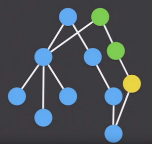
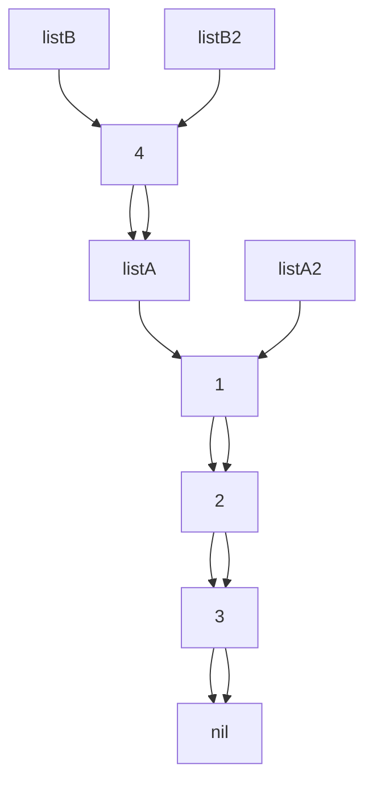
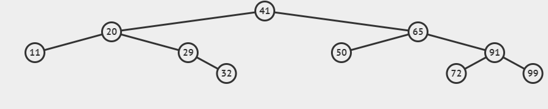

<style>
div.colwrap {
  background-color: inherit;
  color: inherit;
  width: 100%;
  height: 100%;
}
div.colwrap div h1:first-child, div.colwrap div h2:first-child {
  margin-top: 0px !important;
}
div.colwrap div.left, div.colwrap div.right {
  position: absolute;
  top: 0;
  bottom: 0;
  padding: 70px 35px 70px 70px;
}
div.colwrap div.left {
  right: 50%;
  left: 0;
}
div.colwrap div.right {
  left: 50%;
  right: 0;
}
div.out {
--color-foreground: #000;
}
div.it {
--color-foreground: #006;
}
</style>
<!-- header: '**F# Data Structures**' -->

# F# Data Structures

---

# In this talk
- Immutable Data Structures - why, how
- Structural sharing
- F# List
- F# Map
- F# Set
- List vs Set
- Comparison with C# collections
- IEnumerable, seq - lazy sequences
- note about purity
- ImmutableCollections

---<!-- header: '**F# Data Structures**' -->

# Immutable Data Structures

---

# Why?
- mutation is common source of bugs
- immutable data structures are easier to reason about
  - value  passed to a function, can't be changed
- immutable data structures are thread-safe
- bonus: memory efficient time travelling

---

# How?
- MYTH: to create new immutable value, you need to copy the whole thing
- we can share parts of the structure between old and new value



---<!-- header: '**F# Data Structures**' -->

# Structural sharing

---

# F# (Linked) list

```fsharp
let listA = [1; 2; 3]
let listA2 = 1 :: 2 :: 3 :: []
let listB = [4; 1; 2; 3]
let listB2 = 4 :: listA

listA = listA2
listB = listB2
```



---

- fast iteration, mapping, filtering, append to start
- slow indexing, append on end
- `x :: xs` super fast
- `xs @ ys` slow

---

```fsharp
    [<Benchmark>]
    member _.ListAddToEnd() =
        let rec go i acc =
            if i = 0 then acc
            else go (i - 1) (acc @ [i])
        go size []

    [<Benchmark>]
    member _.ListAddToEndAcc() =
        let rec go i acc =
            if i = 0 then acc
            else go (i - 1) (i :: acc)
        go size [] |> List.rev
```

|          Method |        Mean |      Error |     StdDev |
|---------------- |------------:|-----------:|-----------:|
|    ListAddToEnd | 5,178.36 us | 102.125 us | 139.790 us |
| ListAddToEndAcc |    15.99 us |   0.308 us |   0.303 us |

- List.rev is fast!


---

### search, indexing


- `List.find`, `List.nth` goes through list one by one
- `Set` is better for searching in big lists
- if you really need indexing, use array

<!-- header: '**F# Data Structures**' -->

# Structural sharing

---

# F# Map

Dictionary like immutable data structure

```fsharp
let mapA = Map.ofList [1, "A"; 2, "B"; 3, "C"]
let mapB = Map.ofList [1, "A"; 2, "B"; 3, "C"; 4, "D"]
let mapB2 = Map.add 4 "D" mapA
mapB = mapB2 // true
```

---

Internally implemented as a (balanced) tree

```fsharp
let m = [11; 20; 29; 32; 41; 50; 65; 72; 91; 99] |> List.map (fun x -> x, string x) |> Map.ofList
```



DEMO: https://visualgo.net/en/bst

TODO: make video?

---

- keys must be comparable
- searching for item (`Map.find`, `Map.containsKey`) by binary search
- insert, remove - unchanged part of tree is shared
- functions with predicate on key (`Map.pick`, `Map.findKey`), goes through whole tree! (in keys order)
- keys cannot be duplicite - insert (`Map.add`) repace value if key already exists

---

```fsharp
[1..1000] |> List.groupBy (fun x -> x % 100) |> Map.ofList
```<!-- header: '**F# Data Structures**' -->

# Structural sharing

---

# F# Set

Like `Map`, but without values

---

## When to use Set instead of List?

- generally its faster to search for item with `Set`
- but for small sizes `List.constains` is faster

```
|       Method | Size |          Mean |       Error |      StdDev |
|------------- |----- |--------------:|------------:|------------:|
| **ListContains** |   **64** |      **2.159 μs** |   **0.0431 μs** |   **0.0998 μs** |
|  SetContains |   64 |      4.561 μs |   0.0833 μs |   0.0780 μs |
| **ListContains** |  **128** |      **8.241 μs** |   **0.0473 μs** |   **0.0443 μs** |
|  SetContains |  128 |     10.347 μs |   0.1933 μs |   0.1985 μs |
| **ListContains** |  **256** |     **31.169 μs** |   **0.1609 μs** |   **0.1426 μs** |
|  SetContains |  256 |     23.488 μs |   0.3803 μs |   0.3557 μs |
| **ListContains** |  **512** |    **119.456 μs** |   **0.5491 μs** |   **0.5136 μs** |
|  SetContains |  512 |     52.889 μs |   0.8146 μs |   0.6802 μs |
| **ListContains** | **1024** |    **467.593 μs** |   **1.9139 μs** |   **1.7902 μs** |
|  SetContains | 1024 |    149.908 μs |   1.2287 μs |   1.1494 μs |
| **ListContains** | **8192** | **29,487.104 μs** | **114.3813 μs** | **101.3960 μs** |
|  SetContains | 8192 |  1,548.127 μs |  19.6668 μs |  18.3963 μs |
```

## Another important functions
- `Set.union` - is faster than addinng all items from second set
- `Set.intersect`
- `Set.difference`<!-- header: '**F# Data Structures**' -->

# Comparison with C# collections

---

## Naming

--
Collection | F# | C#
--- | --- | ---
Linked list | `list<'T>` | `LinkedList<T>`
Resizeable array | `ResizeArray<'T>` | `List<T>`
Array | `array<'T>`, `'T[]` | `T[]`
Map (immutable dictionary) | `Map<'K, 'V>` | `ImmutableDictionary<K, V>`
Set (immutable set) | `Set<'T>` | `ImmutableHashSet<T>`
Dictionary (mutable) | - | `Dictionary<K, V>`
HashSet (mutable) | - | `HashSet<T>`
Enumerable | `seq<'T>` | `IEnumerable<T>`

---

# Other useful C# collections

- `Queue<T>`
- `PriorityQueue<T>`
- `ConcurrentDictionary<K, V>`<!-- header: '**F# Data Structures**' -->

# Enumerable, seq - lazy sequences

---

Every collection implements `seq<'T>` (alias for `IEnumerable<T>`) interface.

Interface for reading elements one by one.

Lazy abstraction - elements are computed on demand.

---

```fsharp
xs |> Seq.map (fun x -> expensiveFun x) |> Seq.take 10 |> Seq.toList
```

Only first 10 elements are computed.

```fsharp
xs |> Seq.filter (...) |> Seq.map (fun x -> expensiveFun x) |> Seq.tryFind (...)
```

Only elements that pass the filter are computed.

---

There is cases where using `Seq` can be faster than `List`.

Example: expensive filtering and then taking first *k* elements.

---

Seq can be also used for generating (possible infinite) sequences.

```fsharp
let cycle xs =
    let arr = Array.ofSeq xs
    Seq.initInfinite (fun i -> arr.[i % arr.Length])
```<!-- header: '**F# Data Structures**' -->

# Pure functions

---

Immutable data structures allows us to write pure functions.

Pure function:
- always returns the same result for the same input (referential transparency)
- no side effects

---

- BUT:
- referential transparency can be achived even with mutable data structures
- mutable variables and data structures are perfectly fine when not leaking outside of function

```fsharp
    [<CompiledName("Fold")>]
    let fold<'T, 'State> folder (state: 'State) (list: 'T list) =
        match list with
        | [] -> state
        | _ ->
            let f = OptimizedClosures.FSharpFunc<_, _, _>.Adapt (folder)
            let mutable acc = state

            for x in list do
                acc <- f.Invoke(acc, x)

            acc
```

- no mutable variables / data structures => referential transparency

---

Memoize function:

```fsharp
let memoizeBy projection f =
    let cache = System.Collections.Concurrent.ConcurrentDictionary()
    fun x -> cache.GetOrAdd(projection x, lazy f x).Value
```<!-- header: '**F# Data Structures**' -->

# C# Immutable collections

---

<!-- header: '**F# Data Structures**' -->

# QUESTIONS?

Ask question now, or I start talking about how to make mutable data structures immutable! :)

---

