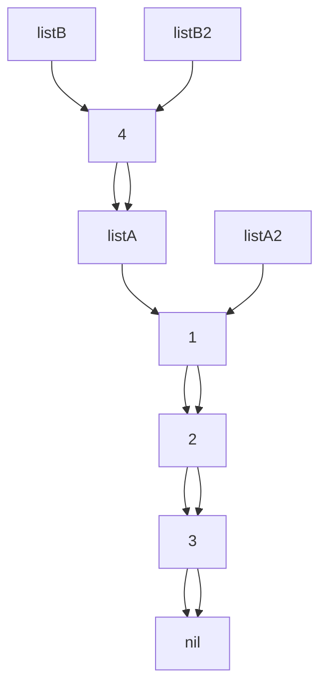

<!-- header: '**F# Data Structures**' -->

# Structural sharing

---

# F# (Linked) list

```fsharp
let listA = [1; 2; 3]
let listA2 = 1 :: 2 :: 3 :: []
let listB = [4; 1; 2; 3]
let listB2 = 4 :: listA

listA = listA2
listB = listB2
```



---

- fast iteration, mapping, filtering, append to start
- slow indexing, append on end
- `x :: xs` super fast
- `xs @ ys` slow

---

```fsharp
    [<Benchmark>]
    member _.ListAddToEnd() =
        let rec go i acc =
            if i = 0 then acc
            else go (i - 1) (acc @ [i])
        go size []

    [<Benchmark>]
    member _.ListAddToEndAcc() =
        let rec go i acc =
            if i = 0 then acc
            else go (i - 1) (i :: acc)
        go size [] |> List.rev
```

|          Method |        Mean |      Error |     StdDev |
|---------------- |------------:|-----------:|-----------:|
|    ListAddToEnd | 5,178.36 us | 102.125 us | 139.790 us |
| ListAddToEndAcc |    15.99 us |   0.308 us |   0.303 us |

- List.rev is fast!


---

TODO: search, indexing