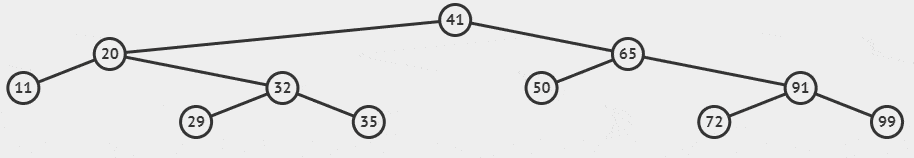

<!-- header: '**F# Data Structures**' -->

# F# Set
Unordered set of values

Internally implemented as a (balanced) tree

```fsharp
let s = [11; 20; 29; 32; 41; 50; 65; 72; 91; 99] |> set
```


---

```fsharp
    (* A classic functional language implementation of binary trees *)

    [<CompilationRepresentation(CompilationRepresentationFlags.UseNullAsTrueValue)>]
    [<NoEquality; NoComparison>]
    type SetTree<'T> when 'T: comparison = 
        | SetEmpty                                          // height = 0   
        | SetNode of 'T * SetTree<'T> *  SetTree<'T> * int    // height = int 
        | SetOne  of 'T                                     // height = 1   
```

---

Insert = search + add

```fsharp
let s2 = s |> Set.add 35
```



from https://visualgo.net/en/bst

---

```fsharp
let s = [1; 7; 3; 9; 5; 6; 2; 8; 4] |> set
```


from https://visualgo.net/en/bst

---

* values must be comparable
* searching for item (`Set.exists`, `Set.contains`) by binary search
* insert, remove - unchanged part of tree is shared

* functions with predicate on value (`Set.map`, `Set.filter`, `Set.partition`), goes through whole tree! (in order)
* keys cannot be duplicite - insert (`Map.add`) repace value if key already exists

---

## When to use Set instead of List?

* generally its faster to search for item with `Set`
* but for small sizes `List.constains` is faster

---

## When to use Set instead of List?

<style scoped>
table {
  font-size: 22px;
}
</style>

|       Method | Size |          Mean |       Error |      StdDev |
|------------- |----- |--------------:|------------:|------------:|
| **ListContains** |   **64** |      **2.159 μs** |   **0.0431 μs** |   **0.0998 μs** |
|  SetContains |   64 |      4.561 μs |   0.0833 μs |   0.0780 μs |
| **ListContains** |  **128** |      **8.241 μs** |   **0.0473 μs** |   **0.0443 μs** |
|  SetContains |  128 |     10.347 μs |   0.1933 μs |   0.1985 μs |
| **ListContains** |  **256** |     **31.169 μs** |   **0.1609 μs** |   **0.1426 μs** |
|  SetContains |  256 |     23.488 μs |   0.3803 μs |   0.3557 μs |
| **ListContains** |  **512** |    **119.456 μs** |   **0.5491 μs** |   **0.5136 μs** |
|  SetContains |  512 |     52.889 μs |   0.8146 μs |   0.6802 μs |
| **ListContains** | **1024** |    **467.593 μs** |   **1.9139 μs** |   **1.7902 μs** |
|  SetContains | 1024 |    149.908 μs |   1.2287 μs |   1.1494 μs |
| **ListContains** | **8192** | **29,487.104 μs** | **114.3813 μs** | **101.3960 μs** |
|  SetContains | 8192 |  1,548.127 μs |  19.6668 μs |  18.3963 μs |

---

## Another important functions
* `Set.union`
* `Set.intersect`
* `Set.difference`

* all of them work recursively on tree structure -> faster than the same on `list`

* `Set.isSubset`
* `Set.isSuperset`

* try to find all elements of first set in second

---
