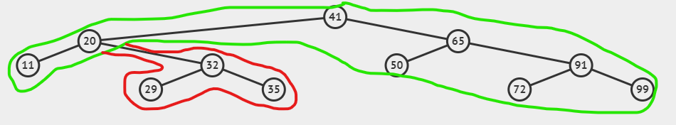

<!-- header: '**F# Data Structures**' -->

# F# Map
* Dictionary like immutable data structure
* Like `Set`, but with value linked with each key (node)

---

```fsharp
let mapA = Map.ofList [1, "A"; 2, "B"; 3, "C"]
let mapB = Map.ofList [1, "A"; 2, "B"; 3, "C"; 4, "D"]
let mapB2 = Map.add 4 "D" mapA
mapB = mapB2 // true
```

---

```fsharp
[<NoEquality; NoComparison>]
[<AllowNullLiteral>]
type internal MapTree<'Key, 'Value>(k: 'Key, v: 'Value, h: int) =
    member _.Height = h
    member _.Key = k
    member _.Value = v
    new(k: 'Key, v: 'Value) = MapTree(k, v, 1)

[<NoEquality; NoComparison>]
[<Sealed>]
[<AllowNullLiteral>]
type internal MapTreeNode<'Key, 'Value>
    (
        k: 'Key,
        v: 'Value,
        left: MapTree<'Key, 'Value>,
        right: MapTree<'Key, 'Value>,
        h: int
    ) =
    inherit MapTree<'Key, 'Value>(k, v, h)
    member _.Left = left
    member _.Right = right
```

---

* keys must be comparable
* searching for item (`Map.find`, `Map.containsKey`) by binary search
* insert, remove - unchanged part of tree is shared

* functions with predicate on key (`Map.pick`, `Map.findKey`), goes through whole tree! (in keys order)
* keys cannot be duplicite - insert (`Map.add`) replace value if key already exists

---

Creation of `Map` - List.groupBy

```fsharp
[1..1000] |> List.groupBy (fun x -> x % 100) |> Map.ofList
```

---
