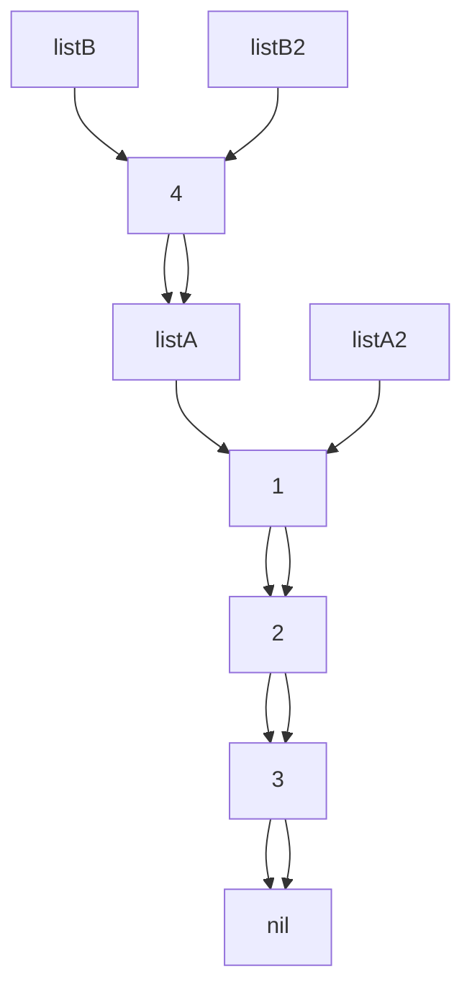

<style>
div.colwrap {
  background-color: inherit;
  color: inherit;
  width: 100%;
  height: 100%;
}
div.colwrap div h1:first-child, div.colwrap div h2:first-child {
  margin-top: 0px !important;
}
div.colwrap div.left, div.colwrap div.right {
  position: absolute;
  top: 0;
  bottom: 0;
  padding: 70px 35px 70px 70px;
}
div.colwrap div.left {
  right: 50%;
  left: 0;
}
div.colwrap div.right {
  left: 50%;
  right: 0;
}
div.out {
--color-foreground: #000;
}
div.it {
--color-foreground: #006;
}
</style>
<!-- header: '**F# Data Structures**' -->

# F# Data Structures

---

# In this talk
- Immutable Data Structures - why, how
- Structural sharing
- F# List
- F# Map
- F# Set
- Comparison with C# collections
- IEnumerable, seq - lazy sequences
- note about purity
- ImmutableCollections
<!-- header: '**F# Data Structures**' -->

# Immutable Data Structures

---

# Why?
- mutation is common source of bugs
- immutable data structures are easier to reason about
  - when you pass a value to a function, you know it won't be changed
- immutable data structures are thread-safe

---

# How?
- MYTH: to create new immutable value, you need to copy the whole thing
- you can share parts of the structure between old and new value
<!-- header: '**F# Data Structures**' -->

# Structural sharing

---

# F# (Linked) list

```fsharp
let listA = [1; 2; 3]
let listA2 = 1 :: 2 :: 3 :: []
let listB = [4; 1; 2; 3]
let listB2 = 4 :: listA

listA = listA2
listB = listB2
```

---

- fast iteration, mapping, filtering
- slow indexing, append on end
- `x :: xs` super fast
- `xs @ ys` slow

---

```fsharp
    [<Benchmark>]
    member _.ListAddToEnd() =
        let rec go i acc =
            if i = 0 then acc
            else go (i - 1) (acc @ [i])
        go size []

    [<Benchmark>]
    member _.ListAddToEndAcc() =
        let rec go i acc =
            if i = 0 then acc
            else go (i - 1) (i :: acc)
        go size [] |> List.rev
```

|          Method |        Mean |      Error |     StdDev |
|---------------- |------------:|-----------:|-----------:|
|    ListAddToEnd | 5,178.36 us | 102.125 us | 139.790 us |
| ListAddToEndAcc |    15.99 us |   0.308 us |   0.303 us |

- List.rev is fast!


---
title: "{title}"
marp: true
//class: invert
paginate: true
theme: gaia
header: ''
---
<style>
div.colwrap {
  background-color: inherit;
  color: inherit;
  width: 100%;
  height: 100%;
}
div.colwrap div h1:first-child, div.colwrap div h2:first-child {
  margin-top: 0px !important;
}
div.colwrap div.left, div.colwrap div.right {
  position: absolute;
  top: 0;
  bottom: 0;
  padding: 70px 35px 70px 70px;
}
div.colwrap div.left {
  right: 50%;
  left: 0;
}
div.colwrap div.right {
  left: 50%;
  right: 0;
}
div.out {
--color-foreground: #000;
}
div.it {
--color-foreground: #006;
}
</style>
<!-- header: '**F# Data Structures**' -->

# F# Data Structures

---

# In this talk
- Immutable Data Structures - why, how
- Structural sharing
- F# List
- F# Map
- F# Set
- Comparison with C# collections
- IEnumerable, seq - lazy sequences
- note about purity
- ImmutableCollections
<!-- header: '**F# Data Structures**' -->

# Immutable Data Structures

---

# Why?
- mutation is common source of bugs
- immutable data structures are easier to reason about
  - when you pass a value to a function, you know it won't be changed
- immutable data structures are thread-safe

---

# How?
- MYTH: to create new immutable value, you need to copy the whole thing
- you can share parts of the structure between old and new value
<!-- header: '**F# Data Structures**' -->

# Structural sharing

---

# F# (Linked) list

```fsharp
let listA = [1; 2; 3]
let listA2 = 1 :: 2 :: 3 :: []
let listB = [4; 1; 2; 3]
let listB2 = 4 :: listA

listA = listA2
listB = listB2
```

---

- fast iteration, mapping, filtering
- slow indexing, append on end
- `x :: xs` super fast
- `xs @ ys` slow

---

```fsharp
    [<Benchmark>]
    member _.ListAddToEnd() =
        let rec go i acc =
            if i = 0 then acc
            else go (i - 1) (acc @ [i])
        go size []

    [<Benchmark>]
    member _.ListAddToEndAcc() =
        let rec go i acc =
            if i = 0 then acc
            else go (i - 1) (i :: acc)
        go size [] |> List.rev
```

|          Method |        Mean |      Error |     StdDev |
|---------------- |------------:|-----------:|-----------:|
|    ListAddToEnd | 5,178.36 us | 102.125 us | 139.790 us |
| ListAddToEndAcc |    15.99 us |   0.308 us |   0.303 us |

- List.rev is fast!


---
title: "{title}"
marp: true
//class: invert
paginate: true
theme: gaia
header: ''
---
<style>
div.colwrap {
  background-color: inherit;
  color: inherit;
  width: 100%;
  height: 100%;
}
div.colwrap div h1:first-child, div.colwrap div h2:first-child {
  margin-top: 0px !important;
}
div.colwrap div.left, div.colwrap div.right {
  position: absolute;
  top: 0;
  bottom: 0;
  padding: 70px 35px 70px 70px;
}
div.colwrap div.left {
  right: 50%;
  left: 0;
}
div.colwrap div.right {
  left: 50%;
  right: 0;
}
div.out {
--color-foreground: #000;
}
div.it {
--color-foreground: #006;
}
</style>
<!-- header: '**F# Data Structures**' -->

# F# Data Structures

---

# In this talk
- Immutable Data Structures - why, how
- Structural sharing
- F# List
- F# Map
- F# Set
- Comparison with C# collections
- IEnumerable, seq - lazy sequences
- note about purity
- ImmutableCollections
<!-- header: '**F# Data Structures**' -->

# Immutable Data Structures

---

# Why?
- mutation is common source of bugs
- immutable data structures are easier to reason about
  - when you pass a value to a function, you know it won't be changed
- immutable data structures are thread-safe

---

# How?
- MYTH: to create new immutable value, you need to copy the whole thing
- you can share parts of the structure between old and new value
<!-- header: '**F# Data Structures**' -->

# Structural sharing

---

# F# (Linked) list

```fsharp
let listA = [1; 2; 3]
let listA2 = 1 :: 2 :: 3 :: []
let listB = [4; 1; 2; 3]
let listB2 = 4 :: listA

listA = listA2
listB = listB2
```

---

- fast iteration, mapping, filtering
- slow indexing, append on end
- `x :: xs` super fast
- `xs @ ys` slow

---

```fsharp
    [<Benchmark>]
    member _.ListAddToEnd() =
        let rec go i acc =
            if i = 0 then acc
            else go (i - 1) (acc @ [i])
        go size []

    [<Benchmark>]
    member _.ListAddToEndAcc() =
        let rec go i acc =
            if i = 0 then acc
            else go (i - 1) (i :: acc)
        go size [] |> List.rev
```

|          Method |        Mean |      Error |     StdDev |
|---------------- |------------:|-----------:|-----------:|
|    ListAddToEnd | 5,178.36 us | 102.125 us | 139.790 us |
| ListAddToEndAcc |    15.99 us |   0.308 us |   0.303 us |

- List.rev is fast!


---
title: "{title}"
marp: true
//class: invert
paginate: true
theme: gaia
header: ''
---
<style>
div.colwrap {
  background-color: inherit;
  color: inherit;
  width: 100%;
  height: 100%;
}
div.colwrap div h1:first-child, div.colwrap div h2:first-child {
  margin-top: 0px !important;
}
div.colwrap div.left, div.colwrap div.right {
  position: absolute;
  top: 0;
  bottom: 0;
  padding: 70px 35px 70px 70px;
}
div.colwrap div.left {
  right: 50%;
  left: 0;
}
div.colwrap div.right {
  left: 50%;
  right: 0;
}
div.out {
--color-foreground: #000;
}
div.it {
--color-foreground: #006;
}
</style>
<!-- header: '**F# Data Structures**' -->

# F# Data Structures

---

# In this talk
- Immutable Data Structures - why, how
- Structural sharing
- F# List
- F# Map
- F# Set
- Comparison with C# collections
- IEnumerable, seq - lazy sequences
- note about purity
- ImmutableCollections
<!-- header: '**F# Data Structures**' -->

# Immutable Data Structures

---

# Why?
- mutation is common source of bugs
- immutable data structures are easier to reason about
  - when you pass a value to a function, you know it won't be changed
- immutable data structures are thread-safe

---

# How?
- MYTH: to create new immutable value, you need to copy the whole thing
- you can share parts of the structure between old and new value
<!-- header: '**F# Data Structures**' -->

# Structural sharing

---

# F# (Linked) list

```fsharp
let listA = [1; 2; 3]
let listA2 = 1 :: 2 :: 3 :: []
let listB = [4; 1; 2; 3]
let listB2 = 4 :: listA

listA = listA2
listB = listB2
```

---

- fast iteration, mapping, filtering
- slow indexing, append on end
- `x :: xs` super fast
- `xs @ ys` slow

---

```fsharp
    [<Benchmark>]
    member _.ListAddToEnd() =
        let rec go i acc =
            if i = 0 then acc
            else go (i - 1) (acc @ [i])
        go size []

    [<Benchmark>]
    member _.ListAddToEndAcc() =
        let rec go i acc =
            if i = 0 then acc
            else go (i - 1) (i :: acc)
        go size [] |> List.rev
```

|          Method |        Mean |      Error |     StdDev |
|---------------- |------------:|-----------:|-----------:|
|    ListAddToEnd | 5,178.36 us | 102.125 us | 139.790 us |
| ListAddToEndAcc |    15.99 us |   0.308 us |   0.303 us |

- List.rev is fast!


---
title: "{title}"
marp: true
//class: invert
paginate: true
theme: gaia
header: ''
---
<style>
div.colwrap {
  background-color: inherit;
  color: inherit;
  width: 100%;
  height: 100%;
}
div.colwrap div h1:first-child, div.colwrap div h2:first-child {
  margin-top: 0px !important;
}
div.colwrap div.left, div.colwrap div.right {
  position: absolute;
  top: 0;
  bottom: 0;
  padding: 70px 35px 70px 70px;
}
div.colwrap div.left {
  right: 50%;
  left: 0;
}
div.colwrap div.right {
  left: 50%;
  right: 0;
}
div.out {
--color-foreground: #000;
}
div.it {
--color-foreground: #006;
}
</style>
<!-- header: '**F# Data Structures**' -->

# F# Data Structures

---

# In this talk
- Immutable Data Structures - why, how
- Structural sharing
- F# List
- F# Map
- F# Set
- Comparison with C# collections
- IEnumerable, seq - lazy sequences
- note about purity
- ImmutableCollections
<!-- header: '**F# Data Structures**' -->

# Immutable Data Structures

---

# Why?
- mutation is common source of bugs
- immutable data structures are easier to reason about
  - when you pass a value to a function, you know it won't be changed
- immutable data structures are thread-safe

---

# How?
- MYTH: to create new immutable value, you need to copy the whole thing
- you can share parts of the structure between old and new value
<!-- header: '**F# Data Structures**' -->

# Structural sharing

---

# F# (Linked) list

```fsharp
let listA = [1; 2; 3]
let listA2 = 1 :: 2 :: 3 :: []
let listB = [4; 1; 2; 3]
let listB2 = 4 :: listA

listA = listA2
listB = listB2
```

---

- fast iteration, mapping, filtering
- slow indexing, append on end
- `x :: xs` super fast
- `xs @ ys` slow

---

```fsharp
    [<Benchmark>]
    member _.ListAddToEnd() =
        let rec go i acc =
            if i = 0 then acc
            else go (i - 1) (acc @ [i])
        go size []

    [<Benchmark>]
    member _.ListAddToEndAcc() =
        let rec go i acc =
            if i = 0 then acc
            else go (i - 1) (i :: acc)
        go size [] |> List.rev
```

|          Method |        Mean |      Error |     StdDev |
|---------------- |------------:|-----------:|-----------:|
|    ListAddToEnd | 5,178.36 us | 102.125 us | 139.790 us |
| ListAddToEndAcc |    15.99 us |   0.308 us |   0.303 us |

- List.rev is fast!


---
title: "{title}"
marp: true
//class: invert
paginate: true
theme: gaia
header: ''
---
<style>
div.colwrap {
  background-color: inherit;
  color: inherit;
  width: 100%;
  height: 100%;
}
div.colwrap div h1:first-child, div.colwrap div h2:first-child {
  margin-top: 0px !important;
}
div.colwrap div.left, div.colwrap div.right {
  position: absolute;
  top: 0;
  bottom: 0;
  padding: 70px 35px 70px 70px;
}
div.colwrap div.left {
  right: 50%;
  left: 0;
}
div.colwrap div.right {
  left: 50%;
  right: 0;
}
div.out {
--color-foreground: #000;
}
div.it {
--color-foreground: #006;
}
</style>
<!-- header: '**F# Data Structures**' -->

# F# Data Structures

---

# In this talk
- Immutable Data Structures - why, how
- Structural sharing
- F# List
- F# Map
- F# Set
- Comparison with C# collections
- IEnumerable, seq - lazy sequences
- note about purity
- ImmutableCollections
<!-- header: '**F# Data Structures**' -->

# Immutable Data Structures

---

# Why?
- mutation is common source of bugs
- immutable data structures are easier to reason about
  - when you pass a value to a function, you know it won't be changed
- immutable data structures are thread-safe

---

# How?
- MYTH: to create new immutable value, you need to copy the whole thing
- you can share parts of the structure between old and new value
<!-- header: '**F# Data Structures**' -->

# Structural sharing

---

# F# (Linked) list

```fsharp
let listA = [1; 2; 3]
let listA2 = 1 :: 2 :: 3 :: []
let listB = [4; 1; 2; 3]
let listB2 = 4 :: listA

listA = listA2
listB = listB2
```

---

- fast iteration, mapping, filtering
- slow indexing, append on end
- `x :: xs` super fast
- `xs @ ys` slow

---

```fsharp
    [<Benchmark>]
    member _.ListAddToEnd() =
        let rec go i acc =
            if i = 0 then acc
            else go (i - 1) (acc @ [i])
        go size []

    [<Benchmark>]
    member _.ListAddToEndAcc() =
        let rec go i acc =
            if i = 0 then acc
            else go (i - 1) (i :: acc)
        go size [] |> List.rev
```

|          Method |        Mean |      Error |     StdDev |
|---------------- |------------:|-----------:|-----------:|
|    ListAddToEnd | 5,178.36 us | 102.125 us | 139.790 us |
| ListAddToEndAcc |    15.99 us |   0.308 us |   0.303 us |

- List.rev is fast!


---
title: "{title}"
marp: true
//class: invert
paginate: true
theme: gaia
header: ''
---
<style>
div.colwrap {
  background-color: inherit;
  color: inherit;
  width: 100%;
  height: 100%;
}
div.colwrap div h1:first-child, div.colwrap div h2:first-child {
  margin-top: 0px !important;
}
div.colwrap div.left, div.colwrap div.right {
  position: absolute;
  top: 0;
  bottom: 0;
  padding: 70px 35px 70px 70px;
}
div.colwrap div.left {
  right: 50%;
  left: 0;
}
div.colwrap div.right {
  left: 50%;
  right: 0;
}
div.out {
--color-foreground: #000;
}
div.it {
--color-foreground: #006;
}
</style>
<!-- header: '**F# Data Structures**' -->

# F# Data Structures

---

# In this talk
- Immutable Data Structures - why, how
- Structural sharing
- F# List
- F# Map
- F# Set
- Comparison with C# collections
- IEnumerable, seq - lazy sequences
- note about purity
- ImmutableCollections
<!-- header: '**F# Data Structures**' -->

# Immutable Data Structures

---

# Why?
- mutation is common source of bugs
- immutable data structures are easier to reason about
  - when you pass a value to a function, you know it won't be changed
- immutable data structures are thread-safe

---

# How?
- MYTH: to create new immutable value, you need to copy the whole thing
- you can share parts of the structure between old and new value
<!-- header: '**F# Data Structures**' -->

# Structural sharing

---

# F# (Linked) list

```fsharp
let listA = [1; 2; 3]
let listA2 = 1 :: 2 :: 3 :: []
let listB = [4; 1; 2; 3]
let listB2 = 4 :: listA

listA = listA2
listB = listB2
```

---

- fast iteration, mapping, filtering
- slow indexing, append on end
- `x :: xs` super fast
- `xs @ ys` slow

---

```fsharp
    [<Benchmark>]
    member _.ListAddToEnd() =
        let rec go i acc =
            if i = 0 then acc
            else go (i - 1) (acc @ [i])
        go size []

    [<Benchmark>]
    member _.ListAddToEndAcc() =
        let rec go i acc =
            if i = 0 then acc
            else go (i - 1) (i :: acc)
        go size [] |> List.rev
```

|          Method |        Mean |      Error |     StdDev |
|---------------- |------------:|-----------:|-----------:|
|    ListAddToEnd | 5,178.36 us | 102.125 us | 139.790 us |
| ListAddToEndAcc |    15.99 us |   0.308 us |   0.303 us |

- List.rev is fast!


---
title: "{title}"
marp: true
//class: invert
paginate: true
theme: gaia
header: ''
---
<style>
div.colwrap {
  background-color: inherit;
  color: inherit;
  width: 100%;
  height: 100%;
}
div.colwrap div h1:first-child, div.colwrap div h2:first-child {
  margin-top: 0px !important;
}
div.colwrap div.left, div.colwrap div.right {
  position: absolute;
  top: 0;
  bottom: 0;
  padding: 70px 35px 70px 70px;
}
div.colwrap div.left {
  right: 50%;
  left: 0;
}
div.colwrap div.right {
  left: 50%;
  right: 0;
}
div.out {
--color-foreground: #000;
}
div.it {
--color-foreground: #006;
}
</style>
<!-- header: '**F# Data Structures**' -->

# F# Data Structures

---

# In this talk
- Immutable Data Structures - why, how
- Structural sharing
- F# List
- F# Map
- F# Set
- Comparison with C# collections
- IEnumerable, seq - lazy sequences
- note about purity
- ImmutableCollections
<!-- header: '**F# Data Structures**' -->

# Immutable Data Structures

---

# Why?
- mutation is common source of bugs
- immutable data structures are easier to reason about
  - when you pass a value to a function, you know it won't be changed
- immutable data structures are thread-safe

---

# How?
- MYTH: to create new immutable value, you need to copy the whole thing
- you can share parts of the structure between old and new value
<!-- header: '**F# Data Structures**' -->

# Structural sharing

---

# F# (Linked) list

```fsharp
let listA = [1; 2; 3]
let listA2 = 1 :: 2 :: 3 :: []
let listB = [4; 1; 2; 3]
let listB2 = 4 :: listA

listA = listA2
listB = listB2
```

---

- fast iteration, mapping, filtering
- slow indexing, append on end
- `x :: xs` super fast
- `xs @ ys` slow

---

```fsharp
    [<Benchmark>]
    member _.ListAddToEnd() =
        let rec go i acc =
            if i = 0 then acc
            else go (i - 1) (acc @ [i])
        go size []

    [<Benchmark>]
    member _.ListAddToEndAcc() =
        let rec go i acc =
            if i = 0 then acc
            else go (i - 1) (i :: acc)
        go size [] |> List.rev
```

|          Method |        Mean |      Error |     StdDev |
|---------------- |------------:|-----------:|-----------:|
|    ListAddToEnd | 5,178.36 us | 102.125 us | 139.790 us |
| ListAddToEndAcc |    15.99 us |   0.308 us |   0.303 us |

- List.rev is fast!


---
title: "{title}"
marp: true
//class: invert
paginate: true
theme: gaia
header: ''
---
<style>
div.colwrap {
  background-color: inherit;
  color: inherit;
  width: 100%;
  height: 100%;
}
div.colwrap div h1:first-child, div.colwrap div h2:first-child {
  margin-top: 0px !important;
}
div.colwrap div.left, div.colwrap div.right {
  position: absolute;
  top: 0;
  bottom: 0;
  padding: 70px 35px 70px 70px;
}
div.colwrap div.left {
  right: 50%;
  left: 0;
}
div.colwrap div.right {
  left: 50%;
  right: 0;
}
div.out {
--color-foreground: #000;
}
div.it {
--color-foreground: #006;
}
</style>
<!-- header: '**F# Data Structures**' -->

# F# Data Structures

---

# In this talk
- Immutable Data Structures - why, how
- Structural sharing
- F# List
- F# Map
- F# Set
- Comparison with C# collections
- IEnumerable, seq - lazy sequences
- note about purity
- ImmutableCollections
<!-- header: '**F# Data Structures**' -->

# Immutable Data Structures

---

# Why?
- mutation is common source of bugs
- immutable data structures are easier to reason about
  - when you pass a value to a function, you know it won't be changed
- immutable data structures are thread-safe

---

# How?
- MYTH: to create new immutable value, you need to copy the whole thing
- you can share parts of the structure between old and new value
<!-- header: '**F# Data Structures**' -->

# Structural sharing

---

# F# (Linked) list

```fsharp
let listA = [1; 2; 3]
let listA2 = 1 :: 2 :: 3 :: []
let listB = [4; 1; 2; 3]
let listB2 = 4 :: listA

listA = listA2
listB = listB2
```

---

- fast iteration, mapping, filtering
- slow indexing, append on end
- `x :: xs` super fast
- `xs @ ys` slow

---

```fsharp
    [<Benchmark>]
    member _.ListAddToEnd() =
        let rec go i acc =
            if i = 0 then acc
            else go (i - 1) (acc @ [i])
        go size []

    [<Benchmark>]
    member _.ListAddToEndAcc() =
        let rec go i acc =
            if i = 0 then acc
            else go (i - 1) (i :: acc)
        go size [] |> List.rev
```

|          Method |        Mean |      Error |     StdDev |
|---------------- |------------:|-----------:|-----------:|
|    ListAddToEnd | 5,178.36 us | 102.125 us | 139.790 us |
| ListAddToEndAcc |    15.99 us |   0.308 us |   0.303 us |

- List.rev is fast!


---
title: "{title}"
marp: true
//class: invert
paginate: true
theme: gaia
header: ''
---
<style>
div.colwrap {
  background-color: inherit;
  color: inherit;
  width: 100%;
  height: 100%;
}
div.colwrap div h1:first-child, div.colwrap div h2:first-child {
  margin-top: 0px !important;
}
div.colwrap div.left, div.colwrap div.right {
  position: absolute;
  top: 0;
  bottom: 0;
  padding: 70px 35px 70px 70px;
}
div.colwrap div.left {
  right: 50%;
  left: 0;
}
div.colwrap div.right {
  left: 50%;
  right: 0;
}
div.out {
--color-foreground: #000;
}
div.it {
--color-foreground: #006;
}
</style>
<!-- header: '**F# Data Structures**' -->

# F# Data Structures

---

# In this talk
- Immutable Data Structures - why, how
- Structural sharing
- F# List
- F# Map
- F# Set
- Comparison with C# collections
- IEnumerable, seq - lazy sequences
- note about purity
- ImmutableCollections
<!-- header: '**F# Data Structures**' -->

# Immutable Data Structures

---

# Why?
- mutation is common source of bugs
- immutable data structures are easier to reason about
  - when you pass a value to a function, you know it won't be changed
- immutable data structures are thread-safe

---

# How?
- MYTH: to create new immutable value, you need to copy the whole thing
- you can share parts of the structure between old and new value
<!-- header: '**F# Data Structures**' -->

# Structural sharing

---

# F# (Linked) list

```fsharp
let listA = [1; 2; 3]
let listA2 = 1 :: 2 :: 3 :: []
let listB = [4; 1; 2; 3]
let listB2 = 4 :: listA

listA = listA2
listB = listB2
```

---

- fast iteration, mapping, filtering
- slow indexing, append on end
- `x :: xs` super fast
- `xs @ ys` slow

---

```fsharp
    [<Benchmark>]
    member _.ListAddToEnd() =
        let rec go i acc =
            if i = 0 then acc
            else go (i - 1) (acc @ [i])
        go size []

    [<Benchmark>]
    member _.ListAddToEndAcc() =
        let rec go i acc =
            if i = 0 then acc
            else go (i - 1) (i :: acc)
        go size [] |> List.rev
```

|          Method |        Mean |      Error |     StdDev |
|---------------- |------------:|-----------:|-----------:|
|    ListAddToEnd | 5,178.36 us | 102.125 us | 139.790 us |
| ListAddToEndAcc |    15.99 us |   0.308 us |   0.303 us |

- List.rev is fast!


---
title: "{title}"
marp: true
//class: invert
paginate: true
theme: gaia
header: ''
---
<style>
div.colwrap {
  background-color: inherit;
  color: inherit;
  width: 100%;
  height: 100%;
}
div.colwrap div h1:first-child, div.colwrap div h2:first-child {
  margin-top: 0px !important;
}
div.colwrap div.left, div.colwrap div.right {
  position: absolute;
  top: 0;
  bottom: 0;
  padding: 70px 35px 70px 70px;
}
div.colwrap div.left {
  right: 50%;
  left: 0;
}
div.colwrap div.right {
  left: 50%;
  right: 0;
}
div.out {
--color-foreground: #000;
}
div.it {
--color-foreground: #006;
}
</style>
<!-- header: '**F# Data Structures**' -->

# F# Data Structures

---

# In this talk
- Immutable Data Structures - why, how
- Structural sharing
- F# List
- F# Map
- F# Set
- Comparison with C# collections
- IEnumerable, seq - lazy sequences
- note about purity
- ImmutableCollections
<!-- header: '**F# Data Structures**' -->

# Immutable Data Structures

---

# Why?
- mutation is common source of bugs
- immutable data structures are easier to reason about
  - when you pass a value to a function, you know it won't be changed
- immutable data structures are thread-safe

---

# How?
- MYTH: to create new immutable value, you need to copy the whole thing
- you can share parts of the structure between old and new value
<!-- header: '**F# Data Structures**' -->

# Structural sharing

---

# F# (Linked) list

```fsharp
let listA = [1; 2; 3]
let listA2 = 1 :: 2 :: 3 :: []
let listB = [4; 1; 2; 3]
let listB2 = 4 :: listA

listA = listA2
listB = listB2
```

---

- fast iteration, mapping, filtering
- slow indexing, append on end
- `x :: xs` super fast
- `xs @ ys` slow

---

```fsharp
    [<Benchmark>]
    member _.ListAddToEnd() =
        let rec go i acc =
            if i = 0 then acc
            else go (i - 1) (acc @ [i])
        go size []

    [<Benchmark>]
    member _.ListAddToEndAcc() =
        let rec go i acc =
            if i = 0 then acc
            else go (i - 1) (i :: acc)
        go size [] |> List.rev
```

|          Method |        Mean |      Error |     StdDev |
|---------------- |------------:|-----------:|-----------:|
|    ListAddToEnd | 5,178.36 us | 102.125 us | 139.790 us |
| ListAddToEndAcc |    15.99 us |   0.308 us |   0.303 us |

- List.rev is fast!


---
title: "{title}"
marp: true
//class: invert
paginate: true
theme: gaia
header: ''
---
<style>
div.colwrap {
  background-color: inherit;
  color: inherit;
  width: 100%;
  height: 100%;
}
div.colwrap div h1:first-child, div.colwrap div h2:first-child {
  margin-top: 0px !important;
}
div.colwrap div.left, div.colwrap div.right {
  position: absolute;
  top: 0;
  bottom: 0;
  padding: 70px 35px 70px 70px;
}
div.colwrap div.left {
  right: 50%;
  left: 0;
}
div.colwrap div.right {
  left: 50%;
  right: 0;
}
div.out {
--color-foreground: #000;
}
div.it {
--color-foreground: #006;
}
</style>
<!-- header: '**F# Data Structures**' -->

# F# Data Structures

---

# In this talk
- Immutable Data Structures - why, how
- Structural sharing
- F# List
- F# Map
- F# Set
- Comparison with C# collections
- IEnumerable, seq - lazy sequences
- note about purity
- ImmutableCollections
<!-- header: '**F# Data Structures**' -->

# Immutable Data Structures

---

# Why?
- mutation is common source of bugs
- immutable data structures are easier to reason about
  - when you pass a value to a function, you know it won't be changed
- immutable data structures are thread-safe

---

# How?
- MYTH: to create new immutable value, you need to copy the whole thing
- you can share parts of the structure between old and new value
<!-- header: '**F# Data Structures**' -->

# Structural sharing

---

# F# (Linked) list

```fsharp
let listA = [1; 2; 3]
let listA2 = 1 :: 2 :: 3 :: []
let listB = [4; 1; 2; 3]
let listB2 = 4 :: listA

listA = listA2
listB = listB2
```

---

- fast iteration, mapping, filtering
- slow indexing, append on end
- `x :: xs` super fast
- `xs @ ys` slow

---

```fsharp
    [<Benchmark>]
    member _.ListAddToEnd() =
        let rec go i acc =
            if i = 0 then acc
            else go (i - 1) (acc @ [i])
        go size []

    [<Benchmark>]
    member _.ListAddToEndAcc() =
        let rec go i acc =
            if i = 0 then acc
            else go (i - 1) (i :: acc)
        go size [] |> List.rev
```

|          Method |        Mean |      Error |     StdDev |
|---------------- |------------:|-----------:|-----------:|
|    ListAddToEnd | 5,178.36 us | 102.125 us | 139.790 us |
| ListAddToEndAcc |    15.99 us |   0.308 us |   0.303 us |

- List.rev is fast!


---
title: "{title}"
marp: true
//class: invert
paginate: true
theme: gaia
header: ''
---
<style>
div.colwrap {
  background-color: inherit;
  color: inherit;
  width: 100%;
  height: 100%;
}
div.colwrap div h1:first-child, div.colwrap div h2:first-child {
  margin-top: 0px !important;
}
div.colwrap div.left, div.colwrap div.right {
  position: absolute;
  top: 0;
  bottom: 0;
  padding: 70px 35px 70px 70px;
}
div.colwrap div.left {
  right: 50%;
  left: 0;
}
div.colwrap div.right {
  left: 50%;
  right: 0;
}
div.out {
--color-foreground: #000;
}
div.it {
--color-foreground: #006;
}
</style>
<!-- header: '**F# Data Structures**' -->

# F# Data Structures

---

# In this talk
- Immutable Data Structures - why, how
- Structural sharing
- F# List
- F# Map
- F# Set
- Comparison with C# collections
- IEnumerable, seq - lazy sequences
- note about purity
- ImmutableCollections
<!-- header: '**F# Data Structures**' -->

# Immutable Data Structures

---

# Why?
- mutation is common source of bugs
- immutable data structures are easier to reason about
  - when you pass a value to a function, you know it won't be changed
- immutable data structures are thread-safe

---

# How?
- MYTH: to create new immutable value, you need to copy the whole thing
- you can share parts of the structure between old and new value
<!-- header: '**F# Data Structures**' -->

# Structural sharing

---

# F# (Linked) list

```fsharp
let listA = [1; 2; 3]
let listA2 = 1 :: 2 :: 3 :: []
let listB = [4; 1; 2; 3]
let listB2 = 4 :: listA

listA = listA2
listB = listB2
```

---

- fast iteration, mapping, filtering
- slow indexing, append on end
- `x :: xs` super fast
- `xs @ ys` slow

---

```fsharp
    [<Benchmark>]
    member _.ListAddToEnd() =
        let rec go i acc =
            if i = 0 then acc
            else go (i - 1) (acc @ [i])
        go size []

    [<Benchmark>]
    member _.ListAddToEndAcc() =
        let rec go i acc =
            if i = 0 then acc
            else go (i - 1) (i :: acc)
        go size [] |> List.rev
```

|          Method |        Mean |      Error |     StdDev |
|---------------- |------------:|-----------:|-----------:|
|    ListAddToEnd | 5,178.36 us | 102.125 us | 139.790 us |
| ListAddToEndAcc |    15.99 us |   0.308 us |   0.303 us |

- List.rev is fast!


---
title: "{title}"
marp: true
//class: invert
paginate: true
theme: gaia
header: ''
---
<style>
div.colwrap {
  background-color: inherit;
  color: inherit;
  width: 100%;
  height: 100%;
}
div.colwrap div h1:first-child, div.colwrap div h2:first-child {
  margin-top: 0px !important;
}
div.colwrap div.left, div.colwrap div.right {
  position: absolute;
  top: 0;
  bottom: 0;
  padding: 70px 35px 70px 70px;
}
div.colwrap div.left {
  right: 50%;
  left: 0;
}
div.colwrap div.right {
  left: 50%;
  right: 0;
}
div.out {
--color-foreground: #000;
}
div.it {
--color-foreground: #006;
}
</style>
<!-- header: '**F# Data Structures**' -->

# F# Data Structures

---

# In this talk
- Immutable Data Structures - why, how
- Structural sharing
- F# List
- F# Map
- F# Set
- Comparison with C# collections
- IEnumerable, seq - lazy sequences
- note about purity
- ImmutableCollections
<!-- header: '**F# Data Structures**' -->

# Immutable Data Structures

---

# Why?
- mutation is common source of bugs
- immutable data structures are easier to reason about
  - when you pass a value to a function, you know it won't be changed
- immutable data structures are thread-safe

---

# How?
- MYTH: to create new immutable value, you need to copy the whole thing
- you can share parts of the structure between old and new value
<!-- header: '**F# Data Structures**' -->

# Structural sharing

---

# F# (Linked) list

```fsharp
let listA = [1; 2; 3]
let listA2 = 1 :: 2 :: 3 :: []
let listB = [4; 1; 2; 3]
let listB2 = 4 :: listA

listA = listA2
listB = listB2
```

---

- fast iteration, mapping, filtering
- slow indexing, append on end
- `x :: xs` super fast
- `xs @ ys` slow

---

```fsharp
    [<Benchmark>]
    member _.ListAddToEnd() =
        let rec go i acc =
            if i = 0 then acc
            else go (i - 1) (acc @ [i])
        go size []

    [<Benchmark>]
    member _.ListAddToEndAcc() =
        let rec go i acc =
            if i = 0 then acc
            else go (i - 1) (i :: acc)
        go size [] |> List.rev
```

|          Method |        Mean |      Error |     StdDev |
|---------------- |------------:|-----------:|-----------:|
|    ListAddToEnd | 5,178.36 us | 102.125 us | 139.790 us |
| ListAddToEndAcc |    15.99 us |   0.308 us |   0.303 us |

- List.rev is fast!


---
title: "{title}"
marp: true
//class: invert
paginate: true
theme: gaia
header: ''
---
<style>
div.colwrap {
  background-color: inherit;
  color: inherit;
  width: 100%;
  height: 100%;
}
div.colwrap div h1:first-child, div.colwrap div h2:first-child {
  margin-top: 0px !important;
}
div.colwrap div.left, div.colwrap div.right {
  position: absolute;
  top: 0;
  bottom: 0;
  padding: 70px 35px 70px 70px;
}
div.colwrap div.left {
  right: 50%;
  left: 0;
}
div.colwrap div.right {
  left: 50%;
  right: 0;
}
div.out {
--color-foreground: #000;
}
div.it {
--color-foreground: #006;
}
</style>
<!-- header: '**F# Data Structures**' -->

# F# Data Structures

---

# In this talk
- Immutable Data Structures - why, how
- Structural sharing
- F# List
- F# Map
- F# Set
- Comparison with C# collections
- IEnumerable, seq - lazy sequences
- note about purity
- ImmutableCollections
<!-- header: '**F# Data Structures**' -->

# Immutable Data Structures

---

# Why?
- mutation is common source of bugs
- immutable data structures are easier to reason about
  - when you pass a value to a function, you know it won't be changed
- immutable data structures are thread-safe

---

# How?
- MYTH: to create new immutable value, you need to copy the whole thing
- you can share parts of the structure between old and new value
<!-- header: '**F# Data Structures**' -->

# Structural sharing

---

# F# (Linked) list

```fsharp
let listA = [1; 2; 3]
let listA2 = 1 :: 2 :: 3 :: []
let listB = [4; 1; 2; 3]
let listB2 = 4 :: listA

listA = listA2
listB = listB2
```

---

- fast iteration, mapping, filtering
- slow indexing, append on end
- `x :: xs` super fast
- `xs @ ys` slow

---

```fsharp
    [<Benchmark>]
    member _.ListAddToEnd() =
        let rec go i acc =
            if i = 0 then acc
            else go (i - 1) (acc @ [i])
        go size []

    [<Benchmark>]
    member _.ListAddToEndAcc() =
        let rec go i acc =
            if i = 0 then acc
            else go (i - 1) (i :: acc)
        go size [] |> List.rev
```

|          Method |        Mean |      Error |     StdDev |
|---------------- |------------:|-----------:|-----------:|
|    ListAddToEnd | 5,178.36 us | 102.125 us | 139.790 us |
| ListAddToEndAcc |    15.99 us |   0.308 us |   0.303 us |

- List.rev is fast!


---
title: "{title}"
marp: true
//class: invert
paginate: true
theme: gaia
header: ''
---
<style>
div.colwrap {
  background-color: inherit;
  color: inherit;
  width: 100%;
  height: 100%;
}
div.colwrap div h1:first-child, div.colwrap div h2:first-child {
  margin-top: 0px !important;
}
div.colwrap div.left, div.colwrap div.right {
  position: absolute;
  top: 0;
  bottom: 0;
  padding: 70px 35px 70px 70px;
}
div.colwrap div.left {
  right: 50%;
  left: 0;
}
div.colwrap div.right {
  left: 50%;
  right: 0;
}
div.out {
--color-foreground: #000;
}
div.it {
--color-foreground: #006;
}
</style>
<!-- header: '**F# Data Structures**' -->

# F# Data Structures

---

# In this talk
- Immutable Data Structures - why, how
- Structural sharing
- F# List
- F# Map
- F# Set
- Comparison with C# collections
- IEnumerable, seq - lazy sequences
- note about purity
- ImmutableCollections
<!-- header: '**F# Data Structures**' -->

# Immutable Data Structures

---

# Why?
- mutation is common source of bugs
- immutable data structures are easier to reason about
  - when you pass a value to a function, you know it won't be changed
- immutable data structures are thread-safe

---

# How?
- MYTH: to create new immutable value, you need to copy the whole thing
- you can share parts of the structure between old and new value
<!-- header: '**F# Data Structures**' -->

# Structural sharing

---

# F# (Linked) list

```fsharp
let listA = [1; 2; 3]
let listA2 = 1 :: 2 :: 3 :: []
let listB = [4; 1; 2; 3]
let listB2 = 4 :: listA

listA = listA2
listB = listB2
```

---

- fast iteration, mapping, filtering
- slow indexing, append on end
- `x :: xs` super fast
- `xs @ ys` slow

---

```fsharp
    [<Benchmark>]
    member _.ListAddToEnd() =
        let rec go i acc =
            if i = 0 then acc
            else go (i - 1) (acc @ [i])
        go size []

    [<Benchmark>]
    member _.ListAddToEndAcc() =
        let rec go i acc =
            if i = 0 then acc
            else go (i - 1) (i :: acc)
        go size [] |> List.rev
```

|          Method |        Mean |      Error |     StdDev |
|---------------- |------------:|-----------:|-----------:|
|    ListAddToEnd | 5,178.36 us | 102.125 us | 139.790 us |
| ListAddToEndAcc |    15.99 us |   0.308 us |   0.303 us |

- List.rev is fast!


---
title: "{title}"
marp: true
//class: invert
paginate: true
theme: gaia
header: ''
---
<style>
div.colwrap {
  background-color: inherit;
  color: inherit;
  width: 100%;
  height: 100%;
}
div.colwrap div h1:first-child, div.colwrap div h2:first-child {
  margin-top: 0px !important;
}
div.colwrap div.left, div.colwrap div.right {
  position: absolute;
  top: 0;
  bottom: 0;
  padding: 70px 35px 70px 70px;
}
div.colwrap div.left {
  right: 50%;
  left: 0;
}
div.colwrap div.right {
  left: 50%;
  right: 0;
}
div.out {
--color-foreground: #000;
}
div.it {
--color-foreground: #006;
}
</style>
<!-- header: '**F# Data Structures**' -->

# F# Data Structures

---

# In this talk
- Immutable Data Structures - why, how
- Structural sharing
- F# List
- F# Map
- F# Set
- Comparison with C# collections
- IEnumerable, seq - lazy sequences
- note about purity
- ImmutableCollections
<!-- header: '**F# Data Structures**' -->

# Immutable Data Structures

---

# Why?
- mutation is common source of bugs
- immutable data structures are easier to reason about
  - when you pass a value to a function, you know it won't be changed
- immutable data structures are thread-safe

---

# How?
- MYTH: to create new immutable value, you need to copy the whole thing
- you can share parts of the structure between old and new value
<!-- header: '**F# Data Structures**' -->

# Structural sharing

---

# F# (Linked) list

```fsharp
let listA = [1; 2; 3]
let listA2 = 1 :: 2 :: 3 :: []
let listB = [4; 1; 2; 3]
let listB2 = 4 :: listA

listA = listA2
listB = listB2
```

---

- fast iteration, mapping, filtering
- slow indexing, append on end
- `x :: xs` super fast
- `xs @ ys` slow

---

```fsharp
    [<Benchmark>]
    member _.ListAddToEnd() =
        let rec go i acc =
            if i = 0 then acc
            else go (i - 1) (acc @ [i])
        go size []

    [<Benchmark>]
    member _.ListAddToEndAcc() =
        let rec go i acc =
            if i = 0 then acc
            else go (i - 1) (i :: acc)
        go size [] |> List.rev
```

|          Method |        Mean |      Error |     StdDev |
|---------------- |------------:|-----------:|-----------:|
|    ListAddToEnd | 5,178.36 us | 102.125 us | 139.790 us |
| ListAddToEndAcc |    15.99 us |   0.308 us |   0.303 us |

- List.rev is fast!


---
title: "{title}"
marp: true
//class: invert
paginate: true
theme: gaia
header: ''
---
<style>
div.colwrap {
  background-color: inherit;
  color: inherit;
  width: 100%;
  height: 100%;
}
div.colwrap div h1:first-child, div.colwrap div h2:first-child {
  margin-top: 0px !important;
}
div.colwrap div.left, div.colwrap div.right {
  position: absolute;
  top: 0;
  bottom: 0;
  padding: 70px 35px 70px 70px;
}
div.colwrap div.left {
  right: 50%;
  left: 0;
}
div.colwrap div.right {
  left: 50%;
  right: 0;
}
div.out {
--color-foreground: #000;
}
div.it {
--color-foreground: #006;
}
</style>
<!-- header: '**F# Data Structures**' -->

# F# Data Structures

---

# In this talk
- Immutable Data Structures - why, how
- Structural sharing
- F# List
- F# Map
- F# Set
- Comparison with C# collections
- IEnumerable, seq - lazy sequences
- note about purity
- ImmutableCollections
<!-- header: '**F# Data Structures**' -->

# Immutable Data Structures

---

# Why?
- mutation is common source of bugs
- immutable data structures are easier to reason about
  - when you pass a value to a function, you know it won't be changed
- immutable data structures are thread-safe

---

# How?
- MYTH: to create new immutable value, you need to copy the whole thing
- you can share parts of the structure between old and new value
<!-- header: '**F# Data Structures**' -->

# Structural sharing

---

# F# (Linked) list

```fsharp
let listA = [1; 2; 3]
let listA2 = 1 :: 2 :: 3 :: []
let listB = [4; 1; 2; 3]
let listB2 = 4 :: listA

listA = listA2
listB = listB2
```

---

- fast iteration, mapping, filtering
- slow indexing, append on end
- `x :: xs` super fast
- `xs @ ys` slow

---

```fsharp
    [<Benchmark>]
    member _.ListAddToEnd() =
        let rec go i acc =
            if i = 0 then acc
            else go (i - 1) (acc @ [i])
        go size []

    [<Benchmark>]
    member _.ListAddToEndAcc() =
        let rec go i acc =
            if i = 0 then acc
            else go (i - 1) (i :: acc)
        go size [] |> List.rev
```

|          Method |        Mean |      Error |     StdDev |
|---------------- |------------:|-----------:|-----------:|
|    ListAddToEnd | 5,178.36 us | 102.125 us | 139.790 us |
| ListAddToEndAcc |    15.99 us |   0.308 us |   0.303 us |

- List.rev is fast!


---
title: "{title}"
marp: true
//class: invert
paginate: true
theme: gaia
header: ''
---
<style>
div.colwrap {
  background-color: inherit;
  color: inherit;
  width: 100%;
  height: 100%;
}
div.colwrap div h1:first-child, div.colwrap div h2:first-child {
  margin-top: 0px !important;
}
div.colwrap div.left, div.colwrap div.right {
  position: absolute;
  top: 0;
  bottom: 0;
  padding: 70px 35px 70px 70px;
}
div.colwrap div.left {
  right: 50%;
  left: 0;
}
div.colwrap div.right {
  left: 50%;
  right: 0;
}
div.out {
--color-foreground: #000;
}
div.it {
--color-foreground: #006;
}
</style>
<!-- header: '**F# Data Structures**' -->

# F# Data Structures

---

# In this talk
- Immutable Data Structures - why, how
- Structural sharing
- F# List
- F# Map
- F# Set
- Comparison with C# collections
- IEnumerable, seq - lazy sequences
- note about purity
- ImmutableCollections
<!-- header: '**F# Data Structures**' -->

# Immutable Data Structures

---

# Why?
- mutation is common source of bugs
- immutable data structures are easier to reason about
  - when you pass a value to a function, you know it won't be changed
- immutable data structures are thread-safe

---

# How?
- MYTH: to create new immutable value, you need to copy the whole thing
- you can share parts of the structure between old and new value
<!-- header: '**F# Data Structures**' -->

# Structural sharing

---

# F# (Linked) list

```fsharp
let listA = [1; 2; 3]
let listA2 = 1 :: 2 :: 3 :: []
let listB = [4; 1; 2; 3]
let listB2 = 4 :: listA

listA = listA2
listB = listB2
```

---

- fast iteration, mapping, filtering
- slow indexing, append on end
- `x :: xs` super fast
- `xs @ ys` slow

---

```fsharp
    [<Benchmark>]
    member _.ListAddToEnd() =
        let rec go i acc =
            if i = 0 then acc
            else go (i - 1) (acc @ [i])
        go size []

    [<Benchmark>]
    member _.ListAddToEndAcc() =
        let rec go i acc =
            if i = 0 then acc
            else go (i - 1) (i :: acc)
        go size [] |> List.rev
```

|          Method |        Mean |      Error |     StdDev |
|---------------- |------------:|-----------:|-----------:|
|    ListAddToEnd | 5,178.36 us | 102.125 us | 139.790 us |
| ListAddToEndAcc |    15.99 us |   0.308 us |   0.303 us |

- List.rev is fast!


---
title: "{title}"
marp: true
//class: invert
paginate: true
theme: gaia
header: ''
---
<style>
div.colwrap {
  background-color: inherit;
  color: inherit;
  width: 100%;
  height: 100%;
}
div.colwrap div h1:first-child, div.colwrap div h2:first-child {
  margin-top: 0px !important;
}
div.colwrap div.left, div.colwrap div.right {
  position: absolute;
  top: 0;
  bottom: 0;
  padding: 70px 35px 70px 70px;
}
div.colwrap div.left {
  right: 50%;
  left: 0;
}
div.colwrap div.right {
  left: 50%;
  right: 0;
}
div.out {
--color-foreground: #000;
}
div.it {
--color-foreground: #006;
}
</style>
<!-- header: '**F# Data Structures**' -->

# F# Data Structures

---

# In this talk
- Immutable Data Structures - why, how
- Structural sharing
- F# List
- F# Map
- F# Set
- Comparison with C# collections
- IEnumerable, seq - lazy sequences
- note about purity
- ImmutableCollections
<!-- header: '**F# Data Structures**' -->

# Immutable Data Structures

---

# Why?
- mutation is common source of bugs
- immutable data structures are easier to reason about
  - when you pass a value to a function, you know it won't be changed
- immutable data structures are thread-safe

---

# How?
- MYTH: to create new immutable value, you need to copy the whole thing
- you can share parts of the structure between old and new value
<!-- header: '**F# Data Structures**' -->

# Structural sharing

---

# F# (Linked) list

```fsharp
let listA = [1; 2; 3]
let listA2 = 1 :: 2 :: 3 :: []
let listB = [4; 1; 2; 3]
let listB2 = 4 :: listA

listA = listA2
listB = listB2
```

---

- fast iteration, mapping, filtering
- slow indexing, append on end
- `x :: xs` super fast
- `xs @ ys` slow

---

```fsharp
    [<Benchmark>]
    member _.ListAddToEnd() =
        let rec go i acc =
            if i = 0 then acc
            else go (i - 1) (acc @ [i])
        go size []

    [<Benchmark>]
    member _.ListAddToEndAcc() =
        let rec go i acc =
            if i = 0 then acc
            else go (i - 1) (i :: acc)
        go size [] |> List.rev
```

|          Method |        Mean |      Error |     StdDev |
|---------------- |------------:|-----------:|-----------:|
|    ListAddToEnd | 5,178.36 us | 102.125 us | 139.790 us |
| ListAddToEndAcc |    15.99 us |   0.308 us |   0.303 us |

- List.rev is fast!


---
title: "{title}"
marp: true
//class: invert
paginate: true
theme: gaia
header: ''
---
<style>
div.colwrap {
  background-color: inherit;
  color: inherit;
  width: 100%;
  height: 100%;
}
div.colwrap div h1:first-child, div.colwrap div h2:first-child {
  margin-top: 0px !important;
}
div.colwrap div.left, div.colwrap div.right {
  position: absolute;
  top: 0;
  bottom: 0;
  padding: 70px 35px 70px 70px;
}
div.colwrap div.left {
  right: 50%;
  left: 0;
}
div.colwrap div.right {
  left: 50%;
  right: 0;
}
div.out {
--color-foreground: #000;
}
div.it {
--color-foreground: #006;
}
</style>
<!-- header: '**F# Data Structures**' -->

# F# Data Structures

---

# In this talk
- Immutable Data Structures - why, how
- Structural sharing
- F# List
- F# Map
- F# Set
- Comparison with C# collections
- IEnumerable, seq - lazy sequences
- note about purity
- ImmutableCollections
<!-- header: '**F# Data Structures**' -->

# Immutable Data Structures

---

# Why?
- mutation is common source of bugs
- immutable data structures are easier to reason about
  - when you pass a value to a function, you know it won't be changed
- immutable data structures are thread-safe

---

# How?
- MYTH: to create new immutable value, you need to copy the whole thing
- you can share parts of the structure between old and new value
<!-- header: '**F# Data Structures**' -->

# Structural sharing

---

# F# (Linked) list

```fsharp
let listA = [1; 2; 3]
let listA2 = 1 :: 2 :: 3 :: []
let listB = [4; 1; 2; 3]
let listB2 = 4 :: listA

listA = listA2
listB = listB2
```

---

- fast iteration, mapping, filtering
- slow indexing, append on end
- `x :: xs` super fast
- `xs @ ys` slow

---

```fsharp
    [<Benchmark>]
    member _.ListAddToEnd() =
        let rec go i acc =
            if i = 0 then acc
            else go (i - 1) (acc @ [i])
        go size []

    [<Benchmark>]
    member _.ListAddToEndAcc() =
        let rec go i acc =
            if i = 0 then acc
            else go (i - 1) (i :: acc)
        go size [] |> List.rev
```

|          Method |        Mean |      Error |     StdDev |
|---------------- |------------:|-----------:|-----------:|
|    ListAddToEnd | 5,178.36 us | 102.125 us | 139.790 us |
| ListAddToEndAcc |    15.99 us |   0.308 us |   0.303 us |

- List.rev is fast!

```mermaid
graph TD;
    listA --> 1 --> 2 --> 3 --> nil
    listA2 --> 1 --> 2 --> 3 --> nil
    listB --> 4 --> listA
    listB2 --> 4 --> listA
```
---
title: "{title}"
marp: true
//class: invert
paginate: true
theme: gaia
header: ''
---
<style>
div.colwrap {
  background-color: inherit;
  color: inherit;
  width: 100%;
  height: 100%;
}
div.colwrap div h1:first-child, div.colwrap div h2:first-child {
  margin-top: 0px !important;
}
div.colwrap div.left, div.colwrap div.right {
  position: absolute;
  top: 0;
  bottom: 0;
  padding: 70px 35px 70px 70px;
}
div.colwrap div.left {
  right: 50%;
  left: 0;
}
div.colwrap div.right {
  left: 50%;
  right: 0;
}
div.out {
--color-foreground: #000;
}
div.it {
--color-foreground: #006;
}
</style>
<!-- header: '**F# Data Structures**' -->

# F# Data Structures

---

# In this talk
- Immutable Data Structures - why, how
- Structural sharing
- F# List
- F# Map
- F# Set
- Comparison with C# collections
- IEnumerable, seq - lazy sequences
- note about purity
- ImmutableCollections
<!-- header: '**F# Data Structures**' -->

# Immutable Data Structures

---

# Why?
- mutation is common source of bugs
- immutable data structures are easier to reason about
  - when you pass a value to a function, you know it won't be changed
- immutable data structures are thread-safe

---

# How?
- MYTH: to create new immutable value, you need to copy the whole thing
- you can share parts of the structure between old and new value
<!-- header: '**F# Data Structures**' -->

# Structural sharing

---

# F# (Linked) list

```fsharp
let listA = [1; 2; 3]
let listA2 = 1 :: 2 :: 3 :: []
let listB = [4; 1; 2; 3]
let listB2 = 4 :: listA

listA = listA2
listB = listB2
```

---

- fast iteration, mapping, filtering
- slow indexing, append on end
- `x :: xs` super fast
- `xs @ ys` slow

---

```fsharp
    [<Benchmark>]
    member _.ListAddToEnd() =
        let rec go i acc =
            if i = 0 then acc
            else go (i - 1) (acc @ [i])
        go size []

    [<Benchmark>]
    member _.ListAddToEndAcc() =
        let rec go i acc =
            if i = 0 then acc
            else go (i - 1) (i :: acc)
        go size [] |> List.rev
```

|          Method |        Mean |      Error |     StdDev |
|---------------- |------------:|-----------:|-----------:|
|    ListAddToEnd | 5,178.36 us | 102.125 us | 139.790 us |
| ListAddToEndAcc |    15.99 us |   0.308 us |   0.303 us |

- List.rev is fast!

```mermaid
graph TD;
    listA --> 1 --> 2 --> 3 --> nil
    listA2 --> 1 --> 2 --> 3 --> nil
    listB --> 4 --> listA
    listB2 --> 4 --> listA
```
---
title: "{title}"
marp: true
//class: invert
paginate: true
theme: gaia
header: ''
---
<style>
div.colwrap {
  background-color: inherit;
  color: inherit;
  width: 100%;
  height: 100%;
}
div.colwrap div h1:first-child, div.colwrap div h2:first-child {
  margin-top: 0px !important;
}
div.colwrap div.left, div.colwrap div.right {
  position: absolute;
  top: 0;
  bottom: 0;
  padding: 70px 35px 70px 70px;
}
div.colwrap div.left {
  right: 50%;
  left: 0;
}
div.colwrap div.right {
  left: 50%;
  right: 0;
}
div.out {
--color-foreground: #000;
}
div.it {
--color-foreground: #006;
}
</style>
<!-- header: '**F# Data Structures**' -->

# F# Data Structures

---

# In this talk
- Immutable Data Structures - why, how
- Structural sharing
- F# List
- F# Map
- F# Set
- Comparison with C# collections
- IEnumerable, seq - lazy sequences
- note about purity
- ImmutableCollections
<!-- header: '**F# Data Structures**' -->

# Immutable Data Structures

---

# Why?
- mutation is common source of bugs
- immutable data structures are easier to reason about
  - when you pass a value to a function, you know it won't be changed
- immutable data structures are thread-safe

---

# How?
- MYTH: to create new immutable value, you need to copy the whole thing
- you can share parts of the structure between old and new value
<!-- header: '**F# Data Structures**' -->

# Structural sharing

---

# F# (Linked) list

```fsharp
let listA = [1; 2; 3]
let listA2 = 1 :: 2 :: 3 :: []
let listB = [4; 1; 2; 3]
let listB2 = 4 :: listA

listA = listA2
listB = listB2
```

---

- fast iteration, mapping, filtering
- slow indexing, append on end
- `x :: xs` super fast
- `xs @ ys` slow

---

```fsharp
    [<Benchmark>]
    member _.ListAddToEnd() =
        let rec go i acc =
            if i = 0 then acc
            else go (i - 1) (acc @ [i])
        go size []

    [<Benchmark>]
    member _.ListAddToEndAcc() =
        let rec go i acc =
            if i = 0 then acc
            else go (i - 1) (i :: acc)
        go size [] |> List.rev
```

|          Method |        Mean |      Error |     StdDev |
|---------------- |------------:|-----------:|-----------:|
|    ListAddToEnd | 5,178.36 us | 102.125 us | 139.790 us |
| ListAddToEndAcc |    15.99 us |   0.308 us |   0.303 us |

- List.rev is fast!

```mermaid
graph TD;
    listA --> 1 --> 2 --> 3 --> nil
    listA2 --> 1 --> 2 --> 3 --> nil
    listB --> 4 --> listA
    listB2 --> 4 --> listA
```
---
title: "{title}"
marp: true
//class: invert
paginate: true
theme: gaia
header: ''
---
<style>
div.colwrap {
  background-color: inherit;
  color: inherit;
  width: 100%;
  height: 100%;
}
div.colwrap div h1:first-child, div.colwrap div h2:first-child {
  margin-top: 0px !important;
}
div.colwrap div.left, div.colwrap div.right {
  position: absolute;
  top: 0;
  bottom: 0;
  padding: 70px 35px 70px 70px;
}
div.colwrap div.left {
  right: 50%;
  left: 0;
}
div.colwrap div.right {
  left: 50%;
  right: 0;
}
div.out {
--color-foreground: #000;
}
div.it {
--color-foreground: #006;
}
</style>
<!-- header: '**F# Data Structures**' -->

# F# Data Structures

---

# In this talk
- Immutable Data Structures - why, how
- Structural sharing
- F# List
- F# Map
- F# Set
- Comparison with C# collections
- IEnumerable, seq - lazy sequences
- note about purity
- ImmutableCollections
<!-- header: '**F# Data Structures**' -->

# Immutable Data Structures

---

# Why?
- mutation is common source of bugs
- immutable data structures are easier to reason about
  - when you pass a value to a function, you know it won't be changed
- immutable data structures are thread-safe

---

# How?
- MYTH: to create new immutable value, you need to copy the whole thing
- you can share parts of the structure between old and new value
<!-- header: '**F# Data Structures**' -->

# Structural sharing

---

# F# (Linked) list

```fsharp
let listA = [1; 2; 3]
let listA2 = 1 :: 2 :: 3 :: []
let listB = [4; 1; 2; 3]
let listB2 = 4 :: listA

listA = listA2
listB = listB2
```

---

- fast iteration, mapping, filtering
- slow indexing, append on end
- `x :: xs` super fast
- `xs @ ys` slow

---

```fsharp
    [<Benchmark>]
    member _.ListAddToEnd() =
        let rec go i acc =
            if i = 0 then acc
            else go (i - 1) (acc @ [i])
        go size []

    [<Benchmark>]
    member _.ListAddToEndAcc() =
        let rec go i acc =
            if i = 0 then acc
            else go (i - 1) (i :: acc)
        go size [] |> List.rev
```

|          Method |        Mean |      Error |     StdDev |
|---------------- |------------:|-----------:|-----------:|
|    ListAddToEnd | 5,178.36 us | 102.125 us | 139.790 us |
| ListAddToEndAcc |    15.99 us |   0.308 us |   0.303 us |

- List.rev is fast!

```mermaid
graph TD;
    listA --> 1 --> 2 --> 3 --> nil
    listA2 --> 1 --> 2 --> 3 --> nil
    listB --> 4 --> listA
    listB2 --> 4 --> listA
```
---
title: "{title}"
marp: true
//class: invert
paginate: true
theme: gaia
header: ''
---
<style>
div.colwrap {
  background-color: inherit;
  color: inherit;
  width: 100%;
  height: 100%;
}
div.colwrap div h1:first-child, div.colwrap div h2:first-child {
  margin-top: 0px !important;
}
div.colwrap div.left, div.colwrap div.right {
  position: absolute;
  top: 0;
  bottom: 0;
  padding: 70px 35px 70px 70px;
}
div.colwrap div.left {
  right: 50%;
  left: 0;
}
div.colwrap div.right {
  left: 50%;
  right: 0;
}
div.out {
--color-foreground: #000;
}
div.it {
--color-foreground: #006;
}
</style>
<!-- header: '**F# Data Structures**' -->

# F# Data Structures

---

# In this talk
- Immutable Data Structures - why, how
- Structural sharing
- F# List
- F# Map
- F# Set
- Comparison with C# collections
- IEnumerable, seq - lazy sequences
- note about purity
- ImmutableCollections
<!-- header: '**F# Data Structures**' -->

# Immutable Data Structures

---

# Why?
- mutation is common source of bugs
- immutable data structures are easier to reason about
  - when you pass a value to a function, you know it won't be changed
- immutable data structures are thread-safe

---

# How?
- MYTH: to create new immutable value, you need to copy the whole thing
- you can share parts of the structure between old and new value
<!-- header: '**F# Data Structures**' -->

# Structural sharing

---

# F# (Linked) list

```fsharp
let listA = [1; 2; 3]
let listA2 = 1 :: 2 :: 3 :: []
let listB = [4; 1; 2; 3]
let listB2 = 4 :: listA

listA = listA2
listB = listB2
```

---

- fast iteration, mapping, filtering
- slow indexing, append on end
- `x :: xs` super fast
- `xs @ ys` slow

---

```fsharp
    [<Benchmark>]
    member _.ListAddToEnd() =
        let rec go i acc =
            if i = 0 then acc
            else go (i - 1) (acc @ [i])
        go size []

    [<Benchmark>]
    member _.ListAddToEndAcc() =
        let rec go i acc =
            if i = 0 then acc
            else go (i - 1) (i :: acc)
        go size [] |> List.rev
```

|          Method |        Mean |      Error |     StdDev |
|---------------- |------------:|-----------:|-----------:|
|    ListAddToEnd | 5,178.36 us | 102.125 us | 139.790 us |
| ListAddToEndAcc |    15.99 us |   0.308 us |   0.303 us |

- List.rev is fast!

```mermaid
graph TD;
    listA --> 1 --> 2 --> 3 --> nil
    listA2 --> 1 --> 2 --> 3 --> nil
    listB --> 4 --> listA
    listB2 --> 4 --> listA
```
---
title: "{title}"
marp: true
//class: invert
paginate: true
theme: gaia
header: ''
---
<style>
div.colwrap {
  background-color: inherit;
  color: inherit;
  width: 100%;
  height: 100%;
}
div.colwrap div h1:first-child, div.colwrap div h2:first-child {
  margin-top: 0px !important;
}
div.colwrap div.left, div.colwrap div.right {
  position: absolute;
  top: 0;
  bottom: 0;
  padding: 70px 35px 70px 70px;
}
div.colwrap div.left {
  right: 50%;
  left: 0;
}
div.colwrap div.right {
  left: 50%;
  right: 0;
}
div.out {
--color-foreground: #000;
}
div.it {
--color-foreground: #006;
}
</style>
<!-- header: '**F# Data Structures**' -->

# F# Data Structures

---

# In this talk
- Immutable Data Structures - why, how
- Structural sharing
- F# List
- F# Map
- F# Set
- Comparison with C# collections
- IEnumerable, seq - lazy sequences
- note about purity
- ImmutableCollections
<!-- header: '**F# Data Structures**' -->

# Immutable Data Structures

---

# Why?
- mutation is common source of bugs
- immutable data structures are easier to reason about
  - when you pass a value to a function, you know it won't be changed
- immutable data structures are thread-safe

---

# How?
- MYTH: to create new immutable value, you need to copy the whole thing
- you can share parts of the structure between old and new value
<!-- header: '**F# Data Structures**' -->

# Structural sharing

---

# F# (Linked) list

```fsharp
let listA = [1; 2; 3]
let listA2 = 1 :: 2 :: 3 :: []
let listB = [4; 1; 2; 3]
let listB2 = 4 :: listA

listA = listA2
listB = listB2
```

---

- fast iteration, mapping, filtering
- slow indexing, append on end
- `x :: xs` super fast
- `xs @ ys` slow

---

```fsharp
    [<Benchmark>]
    member _.ListAddToEnd() =
        let rec go i acc =
            if i = 0 then acc
            else go (i - 1) (acc @ [i])
        go size []

    [<Benchmark>]
    member _.ListAddToEndAcc() =
        let rec go i acc =
            if i = 0 then acc
            else go (i - 1) (i :: acc)
        go size [] |> List.rev
```

|          Method |        Mean |      Error |     StdDev |
|---------------- |------------:|-----------:|-----------:|
|    ListAddToEnd | 5,178.36 us | 102.125 us | 139.790 us |
| ListAddToEndAcc |    15.99 us |   0.308 us |   0.303 us |

- List.rev is fast!

```mermaid
graph TD;
    listA --> 1 --> 2 --> 3 --> nil
    listA2 --> 1 --> 2 --> 3 --> nil
    listB --> 4 --> listA
    listB2 --> 4 --> listA
```
---
title: "{title}"
marp: true
//class: invert
paginate: true
theme: gaia
header: ''
---
<style>
div.colwrap {
  background-color: inherit;
  color: inherit;
  width: 100%;
  height: 100%;
}
div.colwrap div h1:first-child, div.colwrap div h2:first-child {
  margin-top: 0px !important;
}
div.colwrap div.left, div.colwrap div.right {
  position: absolute;
  top: 0;
  bottom: 0;
  padding: 70px 35px 70px 70px;
}
div.colwrap div.left {
  right: 50%;
  left: 0;
}
div.colwrap div.right {
  left: 50%;
  right: 0;
}
div.out {
--color-foreground: #000;
}
div.it {
--color-foreground: #006;
}
</style>
<!-- header: '**F# Data Structures**' -->

# F# Data Structures

---

# In this talk
- Immutable Data Structures - why, how
- Structural sharing
- F# List
- F# Map
- F# Set
- Comparison with C# collections
- IEnumerable, seq - lazy sequences
- note about purity
- ImmutableCollections
<!-- header: '**F# Data Structures**' -->

# Immutable Data Structures

---

# Why?
- mutation is common source of bugs
- immutable data structures are easier to reason about
  - when you pass a value to a function, you know it won't be changed
- immutable data structures are thread-safe

---

# How?
- MYTH: to create new immutable value, you need to copy the whole thing
- you can share parts of the structure between old and new value
<!-- header: '**F# Data Structures**' -->

# Structural sharing

---

# F# (Linked) list

```fsharp
let listA = [1; 2; 3]
let listA2 = 1 :: 2 :: 3 :: []
let listB = [4; 1; 2; 3]
let listB2 = 4 :: listA

listA = listA2
listB = listB2
```

---

- fast iteration, mapping, filtering
- slow indexing, append on end
- `x :: xs` super fast
- `xs @ ys` slow

---

```fsharp
    [<Benchmark>]
    member _.ListAddToEnd() =
        let rec go i acc =
            if i = 0 then acc
            else go (i - 1) (acc @ [i])
        go size []

    [<Benchmark>]
    member _.ListAddToEndAcc() =
        let rec go i acc =
            if i = 0 then acc
            else go (i - 1) (i :: acc)
        go size [] |> List.rev
```

|          Method |        Mean |      Error |     StdDev |
|---------------- |------------:|-----------:|-----------:|
|    ListAddToEnd | 5,178.36 us | 102.125 us | 139.790 us |
| ListAddToEndAcc |    15.99 us |   0.308 us |   0.303 us |

- List.rev is fast!

```mermaid
graph TD;
    listA --> 1 --> 2 --> 3 --> nil
    listA2 --> 1 --> 2 --> 3 --> nil
    listB --> 4 --> listA
    listB2 --> 4 --> listA
```
---
title: "{title}"
marp: true
//class: invert
paginate: true
theme: gaia
header: ''
---
<style>
div.colwrap {
  background-color: inherit;
  color: inherit;
  width: 100%;
  height: 100%;
}
div.colwrap div h1:first-child, div.colwrap div h2:first-child {
  margin-top: 0px !important;
}
div.colwrap div.left, div.colwrap div.right {
  position: absolute;
  top: 0;
  bottom: 0;
  padding: 70px 35px 70px 70px;
}
div.colwrap div.left {
  right: 50%;
  left: 0;
}
div.colwrap div.right {
  left: 50%;
  right: 0;
}
div.out {
--color-foreground: #000;
}
div.it {
--color-foreground: #006;
}
</style>
<!-- header: '**F# Data Structures**' -->

# F# Data Structures

---

# In this talk
- Immutable Data Structures - why, how
- Structural sharing
- F# List
- F# Map
- F# Set
- Comparison with C# collections
- IEnumerable, seq - lazy sequences
- note about purity
- ImmutableCollections
<!-- header: '**F# Data Structures**' -->

# Immutable Data Structures

---

# Why?
- mutation is common source of bugs
- immutable data structures are easier to reason about
  - when you pass a value to a function, you know it won't be changed
- immutable data structures are thread-safe

---

# How?
- MYTH: to create new immutable value, you need to copy the whole thing
- you can share parts of the structure between old and new value
<!-- header: '**F# Data Structures**' -->

# Structural sharing

---

# F# (Linked) list

```fsharp
let listA = [1; 2; 3]
let listA2 = 1 :: 2 :: 3 :: []
let listB = [4; 1; 2; 3]
let listB2 = 4 :: listA

listA = listA2
listB = listB2
```

---

- fast iteration, mapping, filtering
- slow indexing, append on end
- `x :: xs` super fast
- `xs @ ys` slow

---

```fsharp
    [<Benchmark>]
    member _.ListAddToEnd() =
        let rec go i acc =
            if i = 0 then acc
            else go (i - 1) (acc @ [i])
        go size []

    [<Benchmark>]
    member _.ListAddToEndAcc() =
        let rec go i acc =
            if i = 0 then acc
            else go (i - 1) (i :: acc)
        go size [] |> List.rev
```

|          Method |        Mean |      Error |     StdDev |
|---------------- |------------:|-----------:|-----------:|
|    ListAddToEnd | 5,178.36 us | 102.125 us | 139.790 us |
| ListAddToEndAcc |    15.99 us |   0.308 us |   0.303 us |

- List.rev is fast!

```mermaid
graph TD;
    listA --> 1 --> 2 --> 3 --> nil
    listA2 --> 1 --> 2 --> 3 --> nil
    listB --> 4 --> listA
    listB2 --> 4 --> listA
```
---
title: "{title}"
marp: true
//class: invert
paginate: true
theme: gaia
header: ''
---
<style>
div.colwrap {
  background-color: inherit;
  color: inherit;
  width: 100%;
  height: 100%;
}
div.colwrap div h1:first-child, div.colwrap div h2:first-child {
  margin-top: 0px !important;
}
div.colwrap div.left, div.colwrap div.right {
  position: absolute;
  top: 0;
  bottom: 0;
  padding: 70px 35px 70px 70px;
}
div.colwrap div.left {
  right: 50%;
  left: 0;
}
div.colwrap div.right {
  left: 50%;
  right: 0;
}
div.out {
--color-foreground: #000;
}
div.it {
--color-foreground: #006;
}
</style>
<!-- header: '**F# Data Structures**' -->

# F# Data Structures

---

# In this talk
- Immutable Data Structures - why, how
- Structural sharing
- F# List
- F# Map
- F# Set
- Comparison with C# collections
- IEnumerable, seq - lazy sequences
- note about purity
- ImmutableCollections
<!-- header: '**F# Data Structures**' -->

# Immutable Data Structures

---

# Why?
- mutation is common source of bugs
- immutable data structures are easier to reason about
  - when you pass a value to a function, you know it won't be changed
- immutable data structures are thread-safe

---

# How?
- MYTH: to create new immutable value, you need to copy the whole thing
- you can share parts of the structure between old and new value
<!-- header: '**F# Data Structures**' -->

# Structural sharing

---

# F# (Linked) list

```fsharp
let listA = [1; 2; 3]
let listA2 = 1 :: 2 :: 3 :: []
let listB = [4; 1; 2; 3]
let listB2 = 4 :: listA

listA = listA2
listB = listB2
```

---

- fast iteration, mapping, filtering
- slow indexing, append on end
- `x :: xs` super fast
- `xs @ ys` slow

---

```fsharp
    [<Benchmark>]
    member _.ListAddToEnd() =
        let rec go i acc =
            if i = 0 then acc
            else go (i - 1) (acc @ [i])
        go size []

    [<Benchmark>]
    member _.ListAddToEndAcc() =
        let rec go i acc =
            if i = 0 then acc
            else go (i - 1) (i :: acc)
        go size [] |> List.rev
```

|          Method |        Mean |      Error |     StdDev |
|---------------- |------------:|-----------:|-----------:|
|    ListAddToEnd | 5,178.36 us | 102.125 us | 139.790 us |
| ListAddToEndAcc |    15.99 us |   0.308 us |   0.303 us |

- List.rev is fast!

```mermaid
graph TD;
    listA --> 1 --> 2 --> 3 --> nil
    listA2 --> 1 --> 2 --> 3 --> nil
    listB --> 4 --> listA
    listB2 --> 4 --> listA
```
---
title: "{title}"
marp: true
//class: invert
paginate: true
theme: gaia
header: ''
---
<style>
div.colwrap {
  background-color: inherit;
  color: inherit;
  width: 100%;
  height: 100%;
}
div.colwrap div h1:first-child, div.colwrap div h2:first-child {
  margin-top: 0px !important;
}
div.colwrap div.left, div.colwrap div.right {
  position: absolute;
  top: 0;
  bottom: 0;
  padding: 70px 35px 70px 70px;
}
div.colwrap div.left {
  right: 50%;
  left: 0;
}
div.colwrap div.right {
  left: 50%;
  right: 0;
}
div.out {
--color-foreground: #000;
}
div.it {
--color-foreground: #006;
}
</style>
<!-- header: '**F# Data Structures**' -->

# F# Data Structures

---

# In this talk
- Immutable Data Structures - why, how
- Structural sharing
- F# List
- F# Map
- F# Set
- Comparison with C# collections
- IEnumerable, seq - lazy sequences
- note about purity
- ImmutableCollections
<!-- header: '**F# Data Structures**' -->

# Immutable Data Structures

---

# Why?
- mutation is common source of bugs
- immutable data structures are easier to reason about
  - when you pass a value to a function, you know it won't be changed
- immutable data structures are thread-safe

---

# How?
- MYTH: to create new immutable value, you need to copy the whole thing
- you can share parts of the structure between old and new value
<!-- header: '**F# Data Structures**' -->

# Structural sharing

---

# F# (Linked) list

```fsharp
let listA = [1; 2; 3]
let listA2 = 1 :: 2 :: 3 :: []
let listB = [4; 1; 2; 3]
let listB2 = 4 :: listA

listA = listA2
listB = listB2
```

---

- fast iteration, mapping, filtering
- slow indexing, append on end
- `x :: xs` super fast
- `xs @ ys` slow

---

```fsharp
    [<Benchmark>]
    member _.ListAddToEnd() =
        let rec go i acc =
            if i = 0 then acc
            else go (i - 1) (acc @ [i])
        go size []

    [<Benchmark>]
    member _.ListAddToEndAcc() =
        let rec go i acc =
            if i = 0 then acc
            else go (i - 1) (i :: acc)
        go size [] |> List.rev
```

|          Method |        Mean |      Error |     StdDev |
|---------------- |------------:|-----------:|-----------:|
|    ListAddToEnd | 5,178.36 us | 102.125 us | 139.790 us |
| ListAddToEndAcc |    15.99 us |   0.308 us |   0.303 us |

- List.rev is fast!

```mermaid
graph TD;
    listA --> 1 --> 2 --> 3 --> nil
    listA2 --> 1 --> 2 --> 3 --> nil
    listB --> 4 --> listA
    listB2 --> 4 --> listA
```
---
title: "{title}"
marp: true
//class: invert
paginate: true
theme: gaia
header: ''
---
<style>
div.colwrap {
  background-color: inherit;
  color: inherit;
  width: 100%;
  height: 100%;
}
div.colwrap div h1:first-child, div.colwrap div h2:first-child {
  margin-top: 0px !important;
}
div.colwrap div.left, div.colwrap div.right {
  position: absolute;
  top: 0;
  bottom: 0;
  padding: 70px 35px 70px 70px;
}
div.colwrap div.left {
  right: 50%;
  left: 0;
}
div.colwrap div.right {
  left: 50%;
  right: 0;
}
div.out {
--color-foreground: #000;
}
div.it {
--color-foreground: #006;
}
</style>
<!-- header: '**F# Data Structures**' -->

# F# Data Structures

---

# In this talk
- Immutable Data Structures - why, how
- Structural sharing
- F# List
- F# Map
- F# Set
- Comparison with C# collections
- IEnumerable, seq - lazy sequences
- note about purity
- ImmutableCollections
<!-- header: '**F# Data Structures**' -->

# Immutable Data Structures

---

# Why?
- mutation is common source of bugs
- immutable data structures are easier to reason about
  - when you pass a value to a function, you know it won't be changed
- immutable data structures are thread-safe

---

# How?
- MYTH: to create new immutable value, you need to copy the whole thing
- you can share parts of the structure between old and new value
<!-- header: '**F# Data Structures**' -->

# Structural sharing

---

# F# (Linked) list

```fsharp
let listA = [1; 2; 3]
let listA2 = 1 :: 2 :: 3 :: []
let listB = [4; 1; 2; 3]
let listB2 = 4 :: listA

listA = listA2
listB = listB2
```

---

- fast iteration, mapping, filtering
- slow indexing, append on end
- `x :: xs` super fast
- `xs @ ys` slow

---

```fsharp
    [<Benchmark>]
    member _.ListAddToEnd() =
        let rec go i acc =
            if i = 0 then acc
            else go (i - 1) (acc @ [i])
        go size []

    [<Benchmark>]
    member _.ListAddToEndAcc() =
        let rec go i acc =
            if i = 0 then acc
            else go (i - 1) (i :: acc)
        go size [] |> List.rev
```

|          Method |        Mean |      Error |     StdDev |
|---------------- |------------:|-----------:|-----------:|
|    ListAddToEnd | 5,178.36 us | 102.125 us | 139.790 us |
| ListAddToEndAcc |    15.99 us |   0.308 us |   0.303 us |

- List.rev is fast!

```mermaid
graph TD;
    listA --> 1 --> 2 --> 3 --> nil
    listA2 --> 1 --> 2 --> 3 --> nil
    listB --> 4 --> listA
    listB2 --> 4 --> listA
```
---
title: "{title}"
marp: true
//class: invert
paginate: true
theme: gaia
header: ''
---
<style>
div.colwrap {
  background-color: inherit;
  color: inherit;
  width: 100%;
  height: 100%;
}
div.colwrap div h1:first-child, div.colwrap div h2:first-child {
  margin-top: 0px !important;
}
div.colwrap div.left, div.colwrap div.right {
  position: absolute;
  top: 0;
  bottom: 0;
  padding: 70px 35px 70px 70px;
}
div.colwrap div.left {
  right: 50%;
  left: 0;
}
div.colwrap div.right {
  left: 50%;
  right: 0;
}
div.out {
--color-foreground: #000;
}
div.it {
--color-foreground: #006;
}
</style>
<!-- header: '**F# Data Structures**' -->

# F# Data Structures

---

# In this talk
- Immutable Data Structures - why, how
- Structural sharing
- F# List
- F# Map
- F# Set
- Comparison with C# collections
- IEnumerable, seq - lazy sequences
- note about purity
- ImmutableCollections
<!-- header: '**F# Data Structures**' -->

# Immutable Data Structures

---

# Why?
- mutation is common source of bugs
- immutable data structures are easier to reason about
  - when you pass a value to a function, you know it won't be changed
- immutable data structures are thread-safe

---

# How?
- MYTH: to create new immutable value, you need to copy the whole thing
- you can share parts of the structure between old and new value
<!-- header: '**F# Data Structures**' -->

# Structural sharing

---

# F# (Linked) list

```fsharp
let listA = [1; 2; 3]
let listA2 = 1 :: 2 :: 3 :: []
let listB = [4; 1; 2; 3]
let listB2 = 4 :: listA

listA = listA2
listB = listB2
```

---

- fast iteration, mapping, filtering
- slow indexing, append on end
- `x :: xs` super fast
- `xs @ ys` slow

---

```fsharp
    [<Benchmark>]
    member _.ListAddToEnd() =
        let rec go i acc =
            if i = 0 then acc
            else go (i - 1) (acc @ [i])
        go size []

    [<Benchmark>]
    member _.ListAddToEndAcc() =
        let rec go i acc =
            if i = 0 then acc
            else go (i - 1) (i :: acc)
        go size [] |> List.rev
```

|          Method |        Mean |      Error |     StdDev |
|---------------- |------------:|-----------:|-----------:|
|    ListAddToEnd | 5,178.36 us | 102.125 us | 139.790 us |
| ListAddToEndAcc |    15.99 us |   0.308 us |   0.303 us |

- List.rev is fast!

```mermaid
graph TD;
    listA --> 1 --> 2 --> 3 --> nil
    listA2 --> 1 --> 2 --> 3 --> nil
    listB --> 4 --> listA
    listB2 --> 4 --> listA
```
---
title: "{title}"
marp: true
//class: invert
paginate: true
theme: gaia
header: ''
---
<style>
div.colwrap {
  background-color: inherit;
  color: inherit;
  width: 100%;
  height: 100%;
}
div.colwrap div h1:first-child, div.colwrap div h2:first-child {
  margin-top: 0px !important;
}
div.colwrap div.left, div.colwrap div.right {
  position: absolute;
  top: 0;
  bottom: 0;
  padding: 70px 35px 70px 70px;
}
div.colwrap div.left {
  right: 50%;
  left: 0;
}
div.colwrap div.right {
  left: 50%;
  right: 0;
}
div.out {
--color-foreground: #000;
}
div.it {
--color-foreground: #006;
}
</style>
<!-- header: '**F# Data Structures**' -->

# F# Data Structures

---

# In this talk
- Immutable Data Structures - why, how
- Structural sharing
- F# List
- F# Map
- F# Set
- Comparison with C# collections
- IEnumerable, seq - lazy sequences
- note about purity
- ImmutableCollections
<!-- header: '**F# Data Structures**' -->

# Immutable Data Structures

---

# Why?
- mutation is common source of bugs
- immutable data structures are easier to reason about
  - when you pass a value to a function, you know it won't be changed
- immutable data structures are thread-safe

---

# How?
- MYTH: to create new immutable value, you need to copy the whole thing
- you can share parts of the structure between old and new value
<!-- header: '**F# Data Structures**' -->

# Structural sharing

---

# F# (Linked) list

```fsharp
let listA = [1; 2; 3]
let listA2 = 1 :: 2 :: 3 :: []
let listB = [4; 1; 2; 3]
let listB2 = 4 :: listA

listA = listA2
listB = listB2
```

---

- fast iteration, mapping, filtering
- slow indexing, append on end
- `x :: xs` super fast
- `xs @ ys` slow

---

```fsharp
    [<Benchmark>]
    member _.ListAddToEnd() =
        let rec go i acc =
            if i = 0 then acc
            else go (i - 1) (acc @ [i])
        go size []

    [<Benchmark>]
    member _.ListAddToEndAcc() =
        let rec go i acc =
            if i = 0 then acc
            else go (i - 1) (i :: acc)
        go size [] |> List.rev
```

|          Method |        Mean |      Error |     StdDev |
|---------------- |------------:|-----------:|-----------:|
|    ListAddToEnd | 5,178.36 us | 102.125 us | 139.790 us |
| ListAddToEndAcc |    15.99 us |   0.308 us |   0.303 us |

- List.rev is fast!

```mermaid
graph TD;
    listA --> 1 --> 2 --> 3 --> nil
    listA2 --> 1 --> 2 --> 3 --> nil
    listB --> 4 --> listA
    listB2 --> 4 --> listA
```
---
title: "{title}"
marp: true
//class: invert
paginate: true
theme: gaia
header: ''
---
<style>
div.colwrap {
  background-color: inherit;
  color: inherit;
  width: 100%;
  height: 100%;
}
div.colwrap div h1:first-child, div.colwrap div h2:first-child {
  margin-top: 0px !important;
}
div.colwrap div.left, div.colwrap div.right {
  position: absolute;
  top: 0;
  bottom: 0;
  padding: 70px 35px 70px 70px;
}
div.colwrap div.left {
  right: 50%;
  left: 0;
}
div.colwrap div.right {
  left: 50%;
  right: 0;
}
div.out {
--color-foreground: #000;
}
div.it {
--color-foreground: #006;
}
</style>
<!-- header: '**F# Data Structures**' -->

# F# Data Structures

---

# In this talk
- Immutable Data Structures - why, how
- Structural sharing
- F# List
- F# Map
- F# Set
- Comparison with C# collections
- IEnumerable, seq - lazy sequences
- note about purity
- ImmutableCollections
<!-- header: '**F# Data Structures**' -->

# Immutable Data Structures

---

# Why?
- mutation is common source of bugs
- immutable data structures are easier to reason about
  - when you pass a value to a function, you know it won't be changed
- immutable data structures are thread-safe

---

# How?
- MYTH: to create new immutable value, you need to copy the whole thing
- you can share parts of the structure between old and new value
<!-- header: '**F# Data Structures**' -->

# Structural sharing

---

# F# (Linked) list

```fsharp
let listA = [1; 2; 3]
let listA2 = 1 :: 2 :: 3 :: []
let listB = [4; 1; 2; 3]
let listB2 = 4 :: listA

listA = listA2
listB = listB2
```

---

- fast iteration, mapping, filtering
- slow indexing, append on end
- `x :: xs` super fast
- `xs @ ys` slow

---

```fsharp
    [<Benchmark>]
    member _.ListAddToEnd() =
        let rec go i acc =
            if i = 0 then acc
            else go (i - 1) (acc @ [i])
        go size []

    [<Benchmark>]
    member _.ListAddToEndAcc() =
        let rec go i acc =
            if i = 0 then acc
            else go (i - 1) (i :: acc)
        go size [] |> List.rev
```

|          Method |        Mean |      Error |     StdDev |
|---------------- |------------:|-----------:|-----------:|
|    ListAddToEnd | 5,178.36 us | 102.125 us | 139.790 us |
| ListAddToEndAcc |    15.99 us |   0.308 us |   0.303 us |

- List.rev is fast!

```mermaid
graph TD;
    listA --> 1 --> 2 --> 3 --> nil
    listA2 --> 1 --> 2 --> 3 --> nil
    listB --> 4 --> listA
    listB2 --> 4 --> listA
```
---
title: "{title}"
marp: true
//class: invert
paginate: true
theme: gaia
header: ''
---
<style>
div.colwrap {
  background-color: inherit;
  color: inherit;
  width: 100%;
  height: 100%;
}
div.colwrap div h1:first-child, div.colwrap div h2:first-child {
  margin-top: 0px !important;
}
div.colwrap div.left, div.colwrap div.right {
  position: absolute;
  top: 0;
  bottom: 0;
  padding: 70px 35px 70px 70px;
}
div.colwrap div.left {
  right: 50%;
  left: 0;
}
div.colwrap div.right {
  left: 50%;
  right: 0;
}
div.out {
--color-foreground: #000;
}
div.it {
--color-foreground: #006;
}
</style>
<!-- header: '**F# Data Structures**' -->

# F# Data Structures

---

# In this talk
- Immutable Data Structures - why, how
- Structural sharing
- F# List
- F# Map
- F# Set
- Comparison with C# collections
- IEnumerable, seq - lazy sequences
- note about purity
- ImmutableCollections
<!-- header: '**F# Data Structures**' -->

# Immutable Data Structures

---

# Why?
- mutation is common source of bugs
- immutable data structures are easier to reason about
  - when you pass a value to a function, you know it won't be changed
- immutable data structures are thread-safe

---

# How?
- MYTH: to create new immutable value, you need to copy the whole thing
- you can share parts of the structure between old and new value
<!-- header: '**F# Data Structures**' -->

# Structural sharing

---

# F# (Linked) list

```fsharp
let listA = [1; 2; 3]
let listA2 = 1 :: 2 :: 3 :: []
let listB = [4; 1; 2; 3]
let listB2 = 4 :: listA

listA = listA2
listB = listB2
```

---

- fast iteration, mapping, filtering
- slow indexing, append on end
- `x :: xs` super fast
- `xs @ ys` slow

---

```fsharp
    [<Benchmark>]
    member _.ListAddToEnd() =
        let rec go i acc =
            if i = 0 then acc
            else go (i - 1) (acc @ [i])
        go size []

    [<Benchmark>]
    member _.ListAddToEndAcc() =
        let rec go i acc =
            if i = 0 then acc
            else go (i - 1) (i :: acc)
        go size [] |> List.rev
```

|          Method |        Mean |      Error |     StdDev |
|---------------- |------------:|-----------:|-----------:|
|    ListAddToEnd | 5,178.36 us | 102.125 us | 139.790 us |
| ListAddToEndAcc |    15.99 us |   0.308 us |   0.303 us |

- List.rev is fast!

```mermaid
graph TD;
    listA --> 1 --> 2 --> 3 --> nil
    listA2 --> 1 --> 2 --> 3 --> nil
    listB --> 4 --> listA
    listB2 --> 4 --> listA
```
---
title: "{title}"
marp: true
//class: invert
paginate: true
theme: gaia
header: ''
---
<style>
div.colwrap {
  background-color: inherit;
  color: inherit;
  width: 100%;
  height: 100%;
}
div.colwrap div h1:first-child, div.colwrap div h2:first-child {
  margin-top: 0px !important;
}
div.colwrap div.left, div.colwrap div.right {
  position: absolute;
  top: 0;
  bottom: 0;
  padding: 70px 35px 70px 70px;
}
div.colwrap div.left {
  right: 50%;
  left: 0;
}
div.colwrap div.right {
  left: 50%;
  right: 0;
}
div.out {
--color-foreground: #000;
}
div.it {
--color-foreground: #006;
}
</style>
<!-- header: '**F# Data Structures**' -->

# F# Data Structures

---

# In this talk
- Immutable Data Structures - why, how
- Structural sharing
- F# List
- F# Map
- F# Set
- Comparison with C# collections
- IEnumerable, seq - lazy sequences
- note about purity
- ImmutableCollections
<!-- header: '**F# Data Structures**' -->

# Immutable Data Structures

---

# Why?
- mutation is common source of bugs
- immutable data structures are easier to reason about
  - when you pass a value to a function, you know it won't be changed
- immutable data structures are thread-safe

---

# How?
- MYTH: to create new immutable value, you need to copy the whole thing
- you can share parts of the structure between old and new value
<!-- header: '**F# Data Structures**' -->

# Structural sharing

---

# F# (Linked) list

```fsharp
let listA = [1; 2; 3]
let listA2 = 1 :: 2 :: 3 :: []
let listB = [4; 1; 2; 3]
let listB2 = 4 :: listA

listA = listA2
listB = listB2
```

---

- fast iteration, mapping, filtering
- slow indexing, append on end
- `x :: xs` super fast
- `xs @ ys` slow

---

```fsharp
    [<Benchmark>]
    member _.ListAddToEnd() =
        let rec go i acc =
            if i = 0 then acc
            else go (i - 1) (acc @ [i])
        go size []

    [<Benchmark>]
    member _.ListAddToEndAcc() =
        let rec go i acc =
            if i = 0 then acc
            else go (i - 1) (i :: acc)
        go size [] |> List.rev
```

|          Method |        Mean |      Error |     StdDev |
|---------------- |------------:|-----------:|-----------:|
|    ListAddToEnd | 5,178.36 us | 102.125 us | 139.790 us |
| ListAddToEndAcc |    15.99 us |   0.308 us |   0.303 us |

- List.rev is fast!

```mermaid
graph TD;
    listA --> 1 --> 2 --> 3 --> nil
    listA2 --> 1 --> 2 --> 3 --> nil
    listB --> 4 --> listA
    listB2 --> 4 --> listA
```
---
title: "{title}"
marp: true
//class: invert
paginate: true
theme: gaia
header: ''
---
<style>
div.colwrap {
  background-color: inherit;
  color: inherit;
  width: 100%;
  height: 100%;
}
div.colwrap div h1:first-child, div.colwrap div h2:first-child {
  margin-top: 0px !important;
}
div.colwrap div.left, div.colwrap div.right {
  position: absolute;
  top: 0;
  bottom: 0;
  padding: 70px 35px 70px 70px;
}
div.colwrap div.left {
  right: 50%;
  left: 0;
}
div.colwrap div.right {
  left: 50%;
  right: 0;
}
div.out {
--color-foreground: #000;
}
div.it {
--color-foreground: #006;
}
</style>
<!-- header: '**F# Data Structures**' -->

# F# Data Structures

---

# In this talk

* Immutable Data Structures - why, how

* Structural sharing

* F# List

* F# Map

* F# Set

* Comparison with C# collections

* IEnumerable, seq - lazy sequences

* note about purity

* ImmutableCollections


<!-- header: '**F# Data Structures**' -->

# Immutable Data Structures

---

# Why?

* mutation is common source of bugs

* immutable data structures are easier to reason about

  * when you pass a value to a function, you know it won't be changed
  

* immutable data structures are thread-safe

---

# How?

* MYTH: to create new immutable value, you need to copy the whole thing

* you can share parts of the structure between old and new value


<!-- header: '**F# Data Structures**' -->

# Structural sharing

---

# F# (Linked) list

```fsharp
let listA = [1; 2; 3]
let listA2 = 1 :: 2 :: 3 :: []
let listB = [4; 1; 2; 3]
let listB2 = 4 :: listA

listA = listA2
listB = listB2

(*

---

- fast iteration, mapping, filtering
- slow indexing, append on end
- `x :: xs` super fast
- `xs @ ys` slow

---
*)

    [<Benchmark>]
    member _.ListAddToEnd() =
        let rec go i acc =
            if i = 0 then acc
            else go (i - 1) (acc @ [i])
        go size []

    [<Benchmark>]
    member _.ListAddToEndAcc() =
        let rec go i acc =
            if i = 0 then acc
            else go (i - 1) (i :: acc)
        go size [] |> List.rev

(*

|          Method |        Mean |      Error |     StdDev |
|---------------- |------------:|-----------:|-----------:|
|    ListAddToEnd | 5,178.36 us | 102.125 us | 139.790 us |
| ListAddToEndAcc |    15.99 us |   0.308 us |   0.303 us |

- List.rev is fast!

```mermaid
graph TD;
    listA --> 1 --> 2 --> 3 --> nil
    listA2 --> 1 --> 2 --> 3 --> nil
    listB --> 4 --> listA
    listB2 --> 4 --> listA
```


*)
<div class="out">

<div class="out">

<div class="out">

<div class="out">

<div class="out">

<div class="out">

<div class="out">

<div class="out">

<div class="out">

<div class="out">

<div class="out">

<div class="out">

<div class="out">

<div class="out">

<div class="out">

<div class="out">

<div class="out">

<div class="out">

<div class="out">

<div class="out">

<div class="out">

<div class="out">

<div class="out">

<div class="out">

<div class="out">

<div class="out">

<div class="out">

<div class="out">

<div class="out">

<div class="out">

<div class="out">

<div class="out">

<div class="out">

<div class="out">

<div class="out">

<div class="out">

<div class="out">

```


