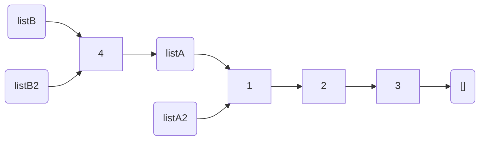
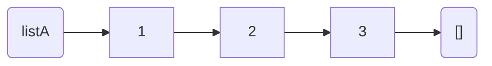

```mermaid
graph LR;
    listA(listA) --> 1 --> 2 --> 3 --> nil("[]")
    listA2(listA2) --> 1
    listB(listB) --> 4 --> listA
    listB2(listB2) --> 4
```

```mermaid
graph LR;
    listA(listA) --> 1 --> 2 --> 3 --> nil("[]")
```